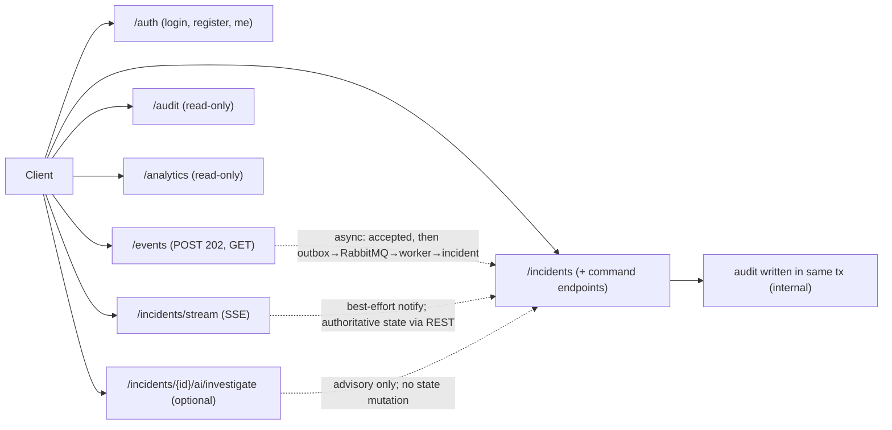

# ForgeOps — API Contracts

Status: Foundation / pre-implementation
Related: [PRD.md](./PRD.md) · [ARCHITECTURE.md](./ARCHITECTURE.md) · [DOMAIN_MODEL.md](./DOMAIN_MODEL.md) · [PERSISTENCE_MODEL.md](./PERSISTENCE_MODEL.md) · [ENGINEERING_INVARIANTS.md](./ENGINEERING_INVARIANTS.md) · [DECISIONS.md](./DECISIONS.md)

> **This is an API interaction contract, not an implementation.** It contains no code, no
> controllers, no DTOs, and no OpenAPI YAML. Paths, methods, fields, and status codes are
> the *contract* the implementation phase must satisfy; example bodies are illustrative and
> contain no real secrets. It is derived from — and must not contradict — the authoritative
> documents above. Where this contract and the domain/persistence models overlap, those
> models govern *behavior*; this document governs the *external interface*.

---

## 1. API design principles

The API is resource-oriented, predictable, explicit, secure by default, validation-driven,
idempotency-aware, concurrency-aware, observable, and consistent in error handling. State
changes that carry domain meaning are expressed as **explicit command endpoints**, never as
a generic mutable resource, so the API can never bypass a domain invariant (§10, §11).
Versioning is intentionally minimal (§4). Every endpoint traces to a PRD/domain
justification (§26); nothing is added merely because it is common in enterprise apps.

---

## 2. Resource inventory

| Concept | Exposed? | Reasoning |
| --- | --- | --- |
| Authentication | **Yes** | Required for all protected access (FR-ID). |
| Users | **Yes** (admin-scoped + self) | Administration and self-identity (FR-ID). |
| Services | **Yes** (read; admin write) | Reference data for events/incidents. |
| Environments | **Yes** (read; admin write) | Reference data. |
| OperationalEvents | **Yes** | Ingestion + retrieval (FR-EV). |
| Incidents | **Yes** | Core domain (FR-IN). |
| Incident assignments | **Yes** (as commands on incident) | Ownership (FR-IN-4). |
| Incident comments/notes | **Yes** | Investigation (FR-IN-5). |
| Audit history | **Yes (read-only)** | Trust/traceability (FR-IN-7). |
| Analytics | **Yes (read-only aggregates)** | Operational visibility (FR-OB). |
| Real-time incident updates | **Yes (SSE)** | Live visibility (FR-RT). |
| AI investigation | **Yes (optional, advisory)** | Secondary capability (FR-AI). |
| **OutboxMessage** | **No — internal** | Implementation detail of reliable handoff; exposing it would leak infrastructure and invite misuse. |
| Notification (as a stored resource) | **No** | Non-authoritative; delivered via SSE, not a REST resource. |

Internal infrastructure concepts (outbox, message broker, Redis) are never exposed.

---

## 3. API versioning

**Decision: URL-based versioning with a single `/api/v1` prefix** (ADR-0026). Rationale:
URL versioning is the simplest professional approach for a new API — visible, cacheable,
trivial to route, and unambiguous in logs. Header/media-type versioning adds negotiation
complexity with no benefit for a project at this stage; "no version" leaves no clean path
to evolve. All paths below are relative to `/api/v1`.

---

## 4. Authentication contract

JWT-based (contract only; no JWT implementation here). Credentials are never returned.

| Operation | Method | Path | Auth | Request (fields) | Success | Failure |
| --- | --- | --- | --- | --- | --- | --- |
| Provision user | POST | `/auth/register` | **Required — ADMIN** | `username`/`email`, `password`, `display_name`, `roles` | `201` user representation (no secret) | `400` validation; `401`/`403`; `409` username taken |
| Login | POST | `/auth/login` | None | `username`, `password` | `200` `{ access_token, token_type, expires_in }` | `400` validation; `401` invalid credentials |
| Current identity | GET | `/auth/me` | Required | — | `200` user representation + roles | `401` unauthenticated |

Validation: required fields present; password meets a minimum policy (length/breached-check
— see [SECURITY_DESIGN.md §4](./SECURITY_DESIGN.md#4-password-storage)). Passwords are never
echoed; only a salted Argon2id hash is stored (INV-SEC-004).

**Registration policy (finalized):** account creation is **administrator-gated**, not open
self-registration — `POST /auth/register` is an authenticated ADMIN provisioning operation
with a one-time bootstrap admin ([ADR-0033](./DECISIONS.md#adr-0033--administrator-created-accounts-no-open-self-registration),
[SECURITY_DESIGN.md §3](./SECURITY_DESIGN.md#3-registration-policy)).

**Tokens (finalized):** v1 issues **short-lived RS256 access tokens only; no refresh
tokens** ([ADR-0032](./DECISIONS.md#adr-0032--rs256-short-lived-access-only-jwts-no-refresh-tokens-in-v1)).

---

## 5. Authorization matrix

Roles per DOMAIN_MODEL: ADMIN, ENGINEER, INCIDENT_MANAGER, VIEWER. "Cond." = allowed but
subject to resource-level context (e.g. ownership) beyond the role check.

| Operation | ADMIN | ENGINEER | INCIDENT_MANAGER | VIEWER |
| --- | --- | --- | --- | --- |
| Manage users / roles | Allow | Deny | Deny | Deny |
| Manage services/environments | Allow | Deny | Deny | Deny |
| Submit operational event | Allow | Allow | Allow | Deny |
| Read events | Allow | Allow | Allow | Allow |
| Read incidents | Allow | Allow | Allow | Allow |
| Create incident (manual) | Allow | Allow | Allow | Deny |
| Acknowledge / investigate / mitigate | Allow | Allow | Allow | Deny |
| Resolve incident | Allow | Allow | Allow | Deny |
| Close incident | Allow | Deny | Allow | Deny |
| Assign / reassign / unassign | Allow | Cond. (self-assign) | Allow | Deny |
| Add comment/note | Allow | Allow | Allow | Deny |
| Read audit | Allow | Allow | Allow | Cond. (if granted) |
| Read analytics | Allow | Allow | Allow | Allow |
| Subscribe SSE | Allow | Allow | Allow | Allow |
| Request AI investigation | Allow | Allow | Allow | Deny |

Resource-level context (not simple role checks): **Close** is restricted to
INCIDENT_MANAGER/ADMIN; **self-assign** lets an ENGINEER assign only themselves;
VIEWER audit access is conditional on being granted. These are enforced server-side
(INV-SEC-005).

---

## 6. Event ingestion API

**Endpoint:** `POST /events`

**Headers:**
- `Authorization: Bearer <token>` — required.
- `Idempotency-Key: <key>` — optional but **required for reliable retry** (§8; scoped to
  the authenticated client per ADR-0025).
- `X-Request-Id: <id>` — optional client correlation id (§22).

**Request fields:**
- Required: `service` (key), `environment` (key), `event_type`, `occurred_at` (RFC 3339
  timestamptz), `payload` (object).
- Optional: `severity` hint, `producer_event_id`, `failure_signature` (if the producer
  computes one; otherwise derived server-side).
- Rules: `service`/`environment` must reference known reference data; `payload` is a
  bounded-size JSON object (a conceptual max size is enforced, exact limit set in
  implementation); `occurred_at` must be a valid timestamp not unreasonably in the future.

**Response — acceptance, not processing completion:**
- `202 Accepted` with the **accepted event representation** (its server-assigned `id`,
  `received_at`, and `status: RECEIVED`). `202` (not `201`) makes explicit that acceptance
  arranges asynchronous processing but does **not** mean detection/correlation has run
  (INV-EVENT-007). Clients learn processing outcomes via event retrieval (§9), incidents
  (§10), or SSE (§17).

**Failures:** `400` validation; `401` unauthenticated; `403` VIEWER; `409` idempotency
conflict (§8 Case C); `422` unknown service/environment; `429` rate limited (§23).

---

## 7. Idempotency HTTP semantics

Behavior is driven by the persistence rule (unique `(client_id, idempotency_key)`, payload
equality by `payload_hash` — ADR-0025). PostgreSQL is authoritative; a second event is
never created for the same key.

| Case | Situation | HTTP behavior |
| --- | --- | --- |
| **A** | New idempotency key | `202 Accepted`; new event created and returned. |
| **B** | Same key + same payload (equal hash) | `202 Accepted` (or `200`) returning the **same** already-accepted event representation. Idempotent replay — no new event, no new outbox record. |
| **C** | Same key + different payload (different hash) | **`409 Conflict`** (Problem Details, §19). The key is already bound to a different submission; the request is rejected and the original event is unchanged. |
| **D** | Same key + original still pending processing | Same as B: return the existing event with `status: RECEIVED`. The original outbox record drives exactly one processing; no second record. |
| **E** | Same key + original already processed | Same as B: return the existing event (its current `status`, e.g. `PROCESSED`, and any `incident_id`). Because processing is idempotent (INV-MSG-003), no duplicate effect. |

**Why `409` for Case C:** the request conflicts with the current state of a resource
identified by the idempotency key — the precise semantics of `409`. It is chosen for
meaning, not by habit. Retries (B/D/E) return the **same resource representation**, so a
client that retries after a timeout converges on one event deterministically.

---

## 8. Event retrieval API

| Operation | Method | Path | Notes |
| --- | --- | --- | --- |
| Get event | GET | `/events/{id}` | Full event representation incl. `status` and `incident_id`. |
| List events | GET | `/events` | Filtered, paginated (§21). |

**Filters (only product-justified):** `service`, `environment`, `incident_id`, `severity`,
`event_type`, `status` (RECEIVED/PROCESSED), `occurred_from`/`occurred_to` (time range).
No filter is exposed without a use. **Pagination:** cursor-based (§21), because event data
grows and offset pagination degrades and skips/duplicates rows under concurrent inserts.

---

## 9. Incident API

Reads are resource-oriented; **mutations are explicit commands** — there is deliberately
**no generic `PATCH /incidents/{id}`**, which could let a client set arbitrary state and
bypass the state machine (§11, INV-INC-002).

| Operation | Method | Path | Notes |
| --- | --- | --- | --- |
| List incidents | GET | `/incidents` | Filter/paginate (§21). |
| Get incident | GET | `/incidents/{id}` | Representation incl. `state`, `severity`, `current_assignee`, `version` (§12). |
| Create incident (manual) | POST | `/incidents` | Authorized manual creation (FR-IN-1). |
| Transition (each) | POST | `/incidents/{id}/{command}` | Explicit commands (§10). |
| Assign / reassign / unassign | POST | `/incidents/{id}/assignment` (+ DELETE to unassign) | §13. |
| Add comment | POST | `/incidents/{id}/comments` | §14. |
| List comments | GET | `/incidents/{id}/comments` | §14. |
| Incident events | GET | `/incidents/{id}/events` | Events aggregated by this incident (0..1 → many). |

**Incident filters:** `state`, `severity`, `service`, `environment`,
`assignee`, `created_from`/`created_to`.

---

## 10. Incident state transition contract

Each transition is a distinct command endpoint (`POST /incidents/{id}/<command>`). Commands
mirror the authoritative state machine (DOMAIN_MODEL §10); the API cannot set a raw state
value. All transitions require `If-Match` (§12) and are transactional + audited (INV-INC-007).

| Command | Path suffix | Allowed roles | Precondition (from-state) | Body |
| --- | --- | --- | --- | --- |
| Acknowledge | `/acknowledge` | ENG, IM, ADMIN | OPEN | — |
| Start investigation | `/investigate` | ENG, IM, ADMIN | OPEN, ACKNOWLEDGED, (MITIGATED→re-investigate), (RESOLVED→reopen) | optional note |
| Mitigate | `/mitigate` | ENG, IM, ADMIN | INVESTIGATING | optional note |
| Resolve | `/resolve` | ENG, IM, ADMIN | MITIGATED | resolution summary |
| Close | `/close` | IM, ADMIN | RESOLVED | optional note |
| Change severity | `/severity` | ENG, IM, ADMIN | any non-terminal | `severity` value |

**Responses per transition:**
- Success → `200` with the updated incident representation (new `state`, incremented
  `version`).
- Invalid transition (not allowed from current state) → **`409 Conflict`** with a Problem
  Details body identifying current vs requested state. Not `400`: the request is
  well-formed; it conflicts with resource state.
- Concurrency conflict (stale `If-Match`) → **`412 Precondition Failed`** (§12).
- Unauthorized role → `403`.

The state machine in DOMAIN_MODEL.md remains authoritative; the API exposes only its legal
commands.

---

## 11. Concurrency / optimistic locking contract

The incident carries a `version` (PERSISTENCE_MODEL §8). The API exposes concurrency via
**HTTP `ETag` / `If-Match`** (ADR-0028):

- `GET /incidents/{id}` returns an `ETag` derived from the incident `version`.
- Every incident mutation (transitions, assignment, severity) **requires `If-Match: <etag>`**.
- Behavior for the stale-write scenario:
  1. Client A reads version N (`ETag: "N"`).
  2. Client B updates → version N+1.
  3. Client A sends a command with `If-Match: "N"` → **`412 Precondition Failed`**; the
     write is rejected, no silent overwrite (INV-INC-005). Client A re-reads (gets N+1) and
     retries against fresh state.

`If-Match` is chosen over an in-body version field because it is the standard HTTP
mechanism for conditional writes and keeps concurrency out of the domain body. A missing
`If-Match` on a mutation → `428 Precondition Required`.

---

## 12. Assignment API

| Operation | Method | Path | Roles |
| --- | --- | --- | --- |
| Assign / reassign | POST | `/incidents/{id}/assignment` | IM, ADMIN; ENG self-assign |
| Unassign | DELETE | `/incidents/{id}/assignment` | IM, ADMIN |

- Body (assign): `assignee_id` (+ optional `team`). Requires `If-Match`.
- The **current assignee is part of the incident representation** (`current_assignee`).
- Assignment **history is append-only and not client-mutable**; there is no endpoint to
  edit or delete historical `incident_assignments` (ADR-0021). History may be exposed
  read-only later if a product need appears; not exposed as mutable data.
- Every assignment change is audited (INV-INC-003).

---

## 13. Comments / investigation notes API

| Operation | Method | Path | Roles |
| --- | --- | --- | --- |
| Add comment | POST | `/incidents/{id}/comments` | ENG, IM, ADMIN |
| List comments | GET | `/incidents/{id}/comments` | any authenticated reader |

- Body: `body` (content), optional `category` (NOTE / INVESTIGATION / RESOLUTION).
- Representation: `id`, `author`, `category`, `body`, `created_at`.
- **Append-only:** no edit or delete endpoints (INV-INC-008; DOMAIN_MODEL §12). The domain
  does not justify editing; introducing it would require an audited edit path and a decision
  record.

---

## 14. Audit API

Audit history is **externally readable, never externally mutable**.

| Operation | Method | Path | Notes |
| --- | --- | --- | --- |
| List audit for a resource | GET | `/audit` | Filter by `resource_type`, `resource_id`, `actor`, time range; paginated. |
| (Convenience) incident audit | GET | `/incidents/{id}/audit` | Audit entries for one incident. |

- **No POST/PUT/PATCH/DELETE on audit** — audit is append-only and written only by the
  domain within transactions (INV-INC-003/007). There is deliberately no endpoint to create,
  modify, or delete audit records.
- Representation: `actor`, `action`, `resource_type`, `resource_id`, `occurred_at`,
  `old_value`, `new_value`, `correlation_id`.

---

## 15. Analytics API

Read-only aggregates over authoritative data (no separate analytics model — DOMAIN_MODEL §16).

| Operation | Method | Path | Notes |
| --- | --- | --- | --- |
| Operational summary | GET | `/analytics/summary` | Aggregate counts (incidents by state/severity, event throughput) over a time range. |

- Filters: `from`/`to` time range, optional `service`/`environment`.
- Authorization: readable by all authenticated roles (VIEWER included).
- Response: a small aggregate shape (counts/series). No giant reporting API; further metrics
  added only when a PRD/observability need is demonstrated (FR-OB).

---

## 16. Real-time SSE contract

**Endpoint:** `GET /incidents/stream` (SSE; `Accept: text/event-stream`). Authenticated.

- **Event types:** `incident.created`, `incident.state_changed`, `incident.assigned`,
  `incident.commented`, `incident.resolved`, `incident.closed`.
- **Event payload:** minimal — subject reference (`incident_id`), change summary, and
  `occurred_at`. Enough to know *what* changed; authoritative detail is fetched via REST.
- **Reconnection:** clients reconnect on disconnect. `Last-Event-ID` **may** be sent but the
  server does **not** guarantee replay — SSE is best-effort (INV-RT-004). No event-replay
  infrastructure is introduced.
- **Non-authoritative (explicit):** if SSE disconnects or an event is missed, **no business
  state is lost**; the client reconnects and retrieves authoritative state via the REST
  incident endpoints (INV-RT-001/002/003). SSE is a notification transport, not a source of
  truth.

---

## 17. AI investigation API (optional, advisory)

**Endpoint:** `POST /incidents/{id}/ai/investigate` (optional capability; may be disabled).

- **Advisory only:** returns an investigation result; it **never mutates incident state**
  (INV-AI-004, ADR-0015). If AI is disabled/unavailable → `503` (or feature-flag `404`),
  and **core incident workflows are unaffected** (INV-AI-005).
- **Response shape (conceptual):**
  - `advisory` — the generated summary/hypotheses/recommended next steps;
  - `evidence` — references to retrieved evidence (event/incident/audit IDs), **clearly
    distinguished from generated inference** (INV-AI-003);
  - `limitations` — stated uncertainty/caveats;
  - `model_metadata` — provider/model identifier and version (no internal prompts);
  - `generated_at` — timestamp.
- **No internal prompts are exposed.** Any action an advisory suggests (e.g. "resolve") must
  be performed by the client through the authorized deterministic command endpoints (§10) —
  the AI endpoint cannot perform it.

---

## 18. Error model

**Adopt RFC 9457 Problem Details** (`application/problem+json`) — ADR-0029. A single,
standard, extensible error shape avoids ad-hoc error bodies and is widely tooled.

Fields: `type` (URI/identifier for the error kind), `title` (short human summary),
`status` (HTTP code), `detail` (human explanation, no internals), `instance` (URI/ref for
this occurrence), plus extensions: `correlation_id` (§22) and, for validation, a structured
`errors` list (field → message).

| Condition | HTTP | Notes |
| --- | --- | --- |
| Validation failure | `400` (syntax) / `422` (domain-level, e.g. unknown reference) | `errors` list populated. |
| Authentication failure | `401` | No detail about which factor failed. |
| Authorization failure | `403` | No resource existence leak where sensitive. |
| Not found | `404` | — |
| Conflict (idempotency / invalid transition) | `409` | §7 Case C, §10. |
| Precondition failed / required (concurrency) | `412` / `428` | §11. |
| Rate limited | `429` | `Retry-After` where possible (§23). |
| Dependency unavailable | `503` | e.g. AI or broker down; no internals leaked. |
| Internal error | `500` | Generic message; **no stack traces or infrastructure detail**. |

Errors never expose stack traces, SQL, broker, or Redis internals.

---

## 19. Validation contract

Two clearly separated layers:

- **Syntax validation** (rejected with `400`): required fields present; correct types; enum
  values valid (`severity`, `category`); string length bounds; timestamp format (RFC 3339);
  identifier format (UUID); payload size within limit; nested payload well-formed JSON.
- **Domain validation** (rejected with `409`/`422`): references exist (known
  service/environment → `422`); incident transition legal from current state (→ `409`);
  idempotency conflict (→ `409`); authorization/ownership.

Business rules live in the domain model and are referenced here, **not duplicated** as DTO
prose. The API documents *that* domain validation occurs and its error mapping; the rules
themselves remain authoritative in DOMAIN_MODEL.md.

---

## 20. Pagination / filtering / sorting

- **Pagination: cursor-based** for potentially large/growing collections (events, incidents,
  audit). A `cursor` (opaque) + `limit` returns a `next_cursor` when more data exists. Cursor
  pagination is stable under concurrent inserts (unlike offset).
- **Page size:** `limit` default (e.g. 50) and a hard maximum (e.g. 200) — exact numbers set
  in implementation; the contract fixes that a bounded default and maximum exist.
- **Sorting:** stable, by creation time / id (time-ordered UUID v7 aids this); a small set of
  documented sort options where needed. No arbitrary sort expressions.
- **Filtering:** simple, predictable query parameters (named per §8/§9); no query language.
- **Time ranges:** `*_from` / `*_to` as RFC 3339 timestamps.

---

## 21. Correlation / request ID

- Clients **may** supply `X-Request-Id`; if absent, the server generates one. It is
  validated (bounded length/charset) and **propagated** through the whole chain: REST →
  domain operation → database → outbox record → RabbitMQ message → consumer → incident →
  audit (`correlation_id`). This enables end-to-end tracing.
- The correlation id is **diagnostic only** and carries **no trust/identity**; it can never
  substitute for the authenticated principal (INV-SEC-005). Clients cannot spoof identity via
  headers.
- It is echoed in responses and in Problem Details (§18) for support/debugging.

---

## 22. Rate limiting contract

Protected classes: **event ingestion**, **authentication endpoints**, and **AI
investigation** (the most abusable/expensive). Behavior when exceeded:

- `429 Too Many Requests` with a Problem Details body and, where possible, a `Retry-After`
  header.
- Internal mechanics (Redis-backed counters) are **never exposed** in the contract.
- **Exact numeric limits are not finalized here** — they are set with justification/measurement
  in implementation; the contract fixes the *behavior*, not the numbers (no fake scalability).

---

## 23. Security contract

- **Authentication** required on all endpoints except login and (optionally) register.
- **Authorization** enforced server-side per §5; ownership/context checks where noted.
- **Input validation** at the boundary (§19); unknown/oversized payloads rejected.
- **Sensitive payloads:** producers must not embed secrets in event `payload`; redaction is
  a future consideration (PERSISTENCE_MODEL §28), not invented now.
- **Credentials:** never returned; only hashed at rest.
- **Error leakage:** none — generic messages, no internals (§18).
- **Endpoint exposure:** internal concepts (outbox, broker, Redis) are not exposed.
- **Audit access:** read-only; never mutable.
- No OAuth/social login (not required); no multi-tenancy.

---

## 24. Observability contract

- Every request carries/gets a `correlation_id` (§21), logged with the operation.
- Responses may include `X-Request-Id` for client-side correlation.
- Business APIs do **not** expose internal infrastructure metrics; health and metrics are
  served through the separate operational surface (Actuator/Prometheus — ARCHITECTURE §4.4),
  not through business endpoints.
- Meaningful operations emit metrics/logs (FR-OB) keyed by correlation id.

---

## 25. API → domain → invariant traceability

| API operation | Domain operation | Invariants exercised |
| --- | --- | --- |
| `POST /events` | Event acceptance (event + outbox, one tx) | INV-EVENT-001/005/006, INV-OUTBOX-001 |
| `POST /events` retry (Case B/D/E) | Idempotent submission resolution | INV-EVENT-005, INV-MSG-003 |
| `GET /events`, `/events/{id}` | Event read | INV-EVENT-004 (immutable content) |
| `POST /incidents` | Manual incident creation | INV-INC-001/006, audit INV-INC-003/007 |
| `POST /incidents/{id}/<transition>` | Incident state transition | INV-INC-002/005/007 |
| `POST/DELETE /incidents/{id}/assignment` | Assignment / reassignment | INV-INC-003 (audited), INV-INC-005 (If-Match) |
| `POST /incidents/{id}/comments` | Append investigation note | INV-INC-008 |
| `GET /audit`, `/incidents/{id}/audit` | Audit read | INV-INC-003 (append-only; read-only externally) |
| `GET /analytics/summary` | Derived read | INV-RT-/read-only; no second source of truth |
| `GET /incidents/stream` (SSE) | Notification delivery | INV-RT-001..004 |
| `POST /incidents/{id}/ai/investigate` | Advisory generation | INV-AI-001..005 |

Every mutation endpoint maps to an explicit domain operation; none bypasses an invariant.

---

## 26. API resource representations (conceptual)

Response shapes expose domain-meaningful fields only — **no persistence internals** (no
outbox status, no raw version columns beyond the ETag, no internal flags).

- **User:** `id`, `username`/`email`, `display_name`, `roles`, `status`. (Never any secret.)
- **Service:** `id`, `key`, `display_name`.
- **Environment:** `id`, `key`.
- **OperationalEvent:** `id`, `service`, `environment`, `event_type`, `severity`,
  `occurred_at`, `received_at`, `status` (RECEIVED/PROCESSED), `incident_id` (nullable),
  `payload`. (No `payload_hash`, no outbox reference.)
- **Incident:** `id`, `title`, `service`, `environment`, `severity`, `state`,
  `current_assignee`, `created_at`, `resolved_at`, `closed_at`. `version` is surfaced as the
  `ETag`, not a raw body field.
- **IncidentAssignment (read-only history, if exposed):** `assignee`, `assigned_by`,
  `assigned_at`, `unassigned_at`, `team`.
- **IncidentComment:** `id`, `author`, `category`, `body`, `created_at`.
- **AuditEntry:** `actor`, `action`, `resource_type`, `resource_id`, `occurred_at`,
  `old_value`, `new_value`, `correlation_id`.
- **Analytics result:** aggregate counts/series for the requested range.
- **AI investigation result:** `advisory`, `evidence[]`, `limitations`, `model_metadata`,
  `generated_at` (§17).

---

## 27. API contract diagram

Synchronous: auth, event acceptance response, incident reads/commands, audit/analytics
reads. Asynchronous: everything after event acceptance (outbox → broker → worker →
incident) and SSE delivery. Solid edges are synchronous request/response; dashed edges are
asynchronous/best-effort.

---

## 28. OpenAPI direction (no YAML yet)

The API will eventually be expressed as **OpenAPI 3.x** (no file generated now — that is an
implementation/tooling task, ADR-0008/§3):
- **Version:** `v1`.
- **Tags/resources:** auth, users, services, environments, events, incidents, audit,
  analytics, ai.
- **Common components:** `ProblemDetails` (§18), pagination envelope (§20), `ETag`/`If-Match`
  parameters (§11), `Idempotency-Key`/`X-Request-Id` headers.
- **Security scheme:** HTTP bearer (JWT) — conceptual; details in the security phase.
- **Reusable schemas:** the resource representations in §26.

---

## 29. Design quality review (self-challenge)

1. **Every endpoint justified?** Yes — §2 maps each to a PRD/domain need; outbox and
   notifications are intentionally not exposed.
2. **Can any endpoint bypass an invariant?** No — no generic incident PATCH; transitions are
   command endpoints validated against the state machine; audit/outbox are not mutable.
3. **Mutations as safe domain operations?** Yes — explicit commands (§10, §12, §13).
4. **Consistent error semantics?** Yes — single Problem Details model (§18).
5. **Concurrency conflicts explicit?** Yes — `If-Match`/`412`/`428` (§11).
6. **Retries safe?** Yes — idempotency semantics return the same event (§7).
7. **Idempotency unambiguous?** Yes — cases A–E defined (§7).
8. **SSE non-authoritative?** Yes — best-effort; REST is authoritative (§16).
9. **AI advisory?** Yes — no mutation; actions routed through authorized commands (§17).
10. **Simple enough for the product?** Yes — minimal versioning, no query language, no
    reporting sprawl, no tenancy.
