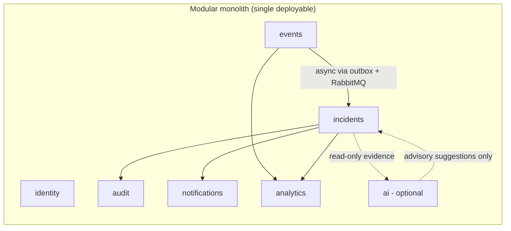
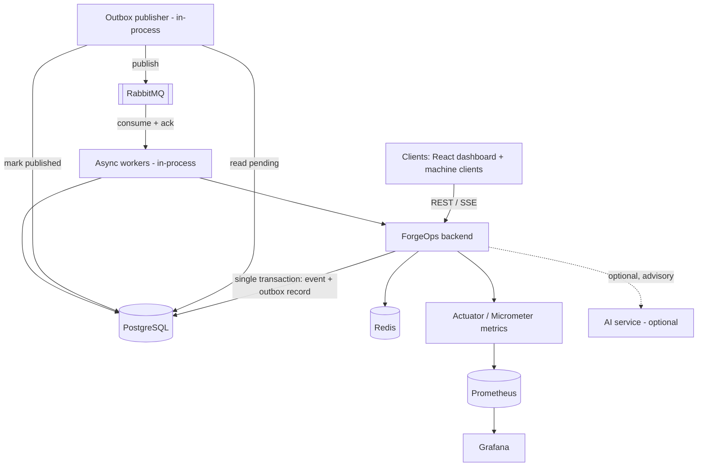
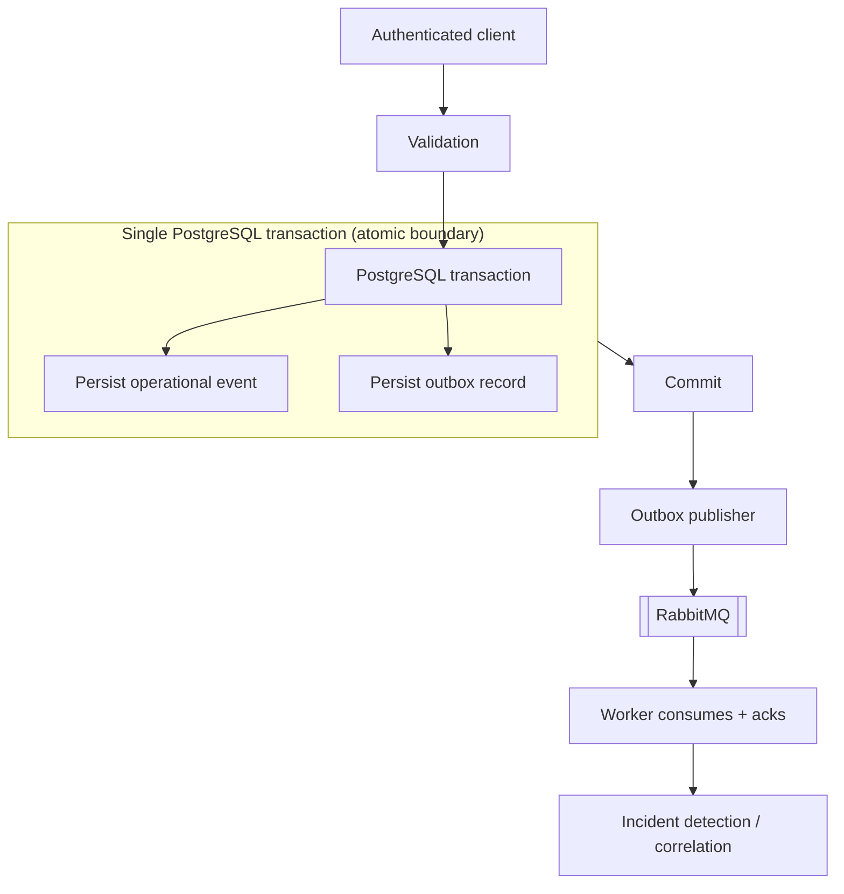
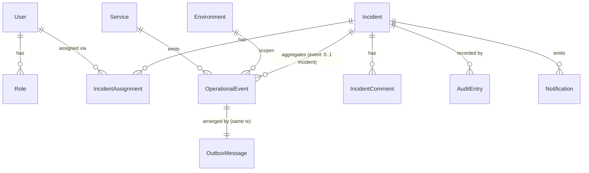
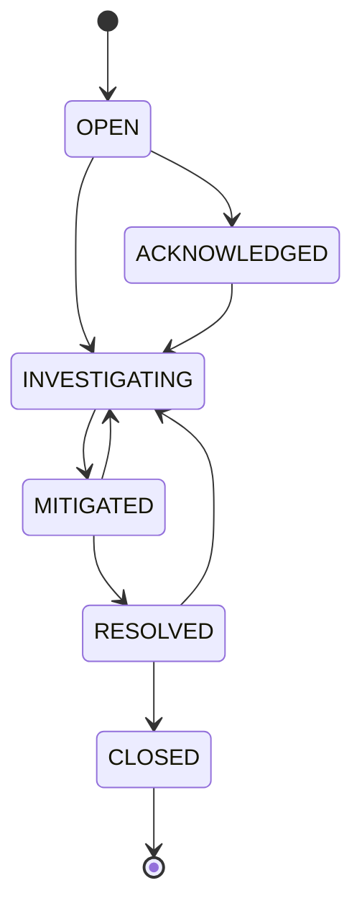
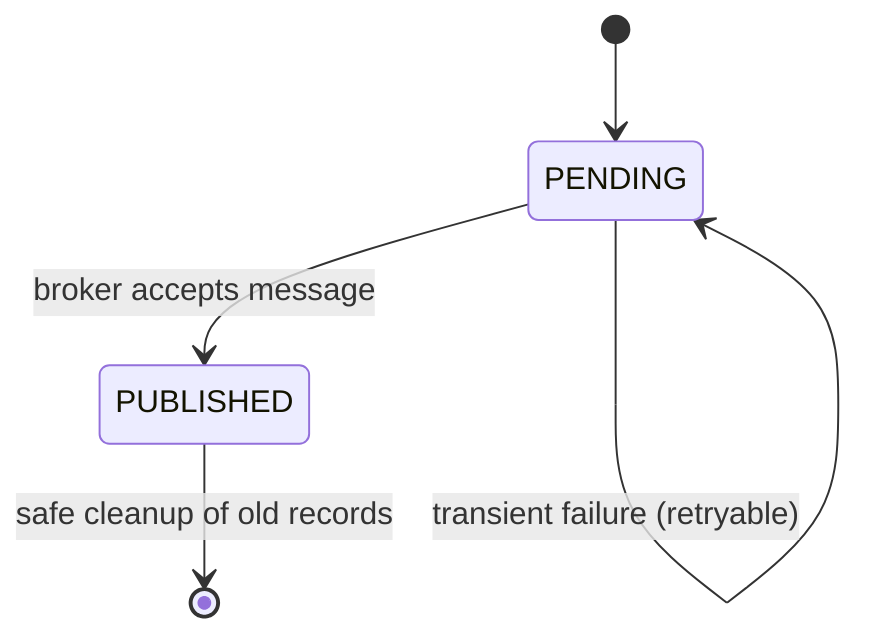

# ForgeOps — Architecture

Status: Foundation / pre-implementation (intended design, not yet built)
Related: [PRD.md](./PRD.md) · [DECISIONS.md](./DECISIONS.md) · [ENGINEERING_CONSTITUTION.md](./ENGINEERING_CONSTITUTION.md) · [TASKS.md](./TASKS.md)

> This document describes the *intended* high-level architecture. Nothing here is
> implemented yet. Concrete technology choices and their rationale are recorded as
> ADRs in [DECISIONS.md](./DECISIONS.md); functional scope is defined in
> [PRD.md](./PRD.md).

---

## 1. Architectural style

ForgeOps starts as a **modular monolith**: a single deployable backend application with
strong internal module boundaries. This is a deliberate choice over microservices at
this stage (see [ADR-0001](./DECISIONS.md#adr-0001--start-with-a-modular-monolith)).

The goals of the style are:

- keep operational and cognitive complexity low while the domain is still being learned;
- enforce clear domain boundaries so behavior stays understandable;
- keep modules decoupled enough that an individual module *could* be extracted into a
  separate service later **if, and only if,** a real architectural reason is demonstrated.

Distributed complexity is not introduced to make the project look sophisticated.

---

## 2. Modules and boundaries

The backend is organized into explicit domain modules. Each module owns its domain
logic and data, and communicates with other modules through well-defined interfaces
(and, for cross-module workflows, through asynchronous events) rather than reaching into
another module's internals.

| Module | Responsibility | Key PRD requirements |
| --- | --- | --- |
| **identity** | Registration, authentication, tokens, roles | FR-ID-* |
| **events** | Event ingestion, validation, persistence, idempotency, publishing | FR-EV-* |
| **incidents** | Incident lifecycle, severity, assignment, notes, resolution, detection/correlation | FR-IN-* |
| **audit** | Durable, append-only audit trail of significant changes | FR-IN-7 |
| **notifications** | Real-time delivery of updates to clients | FR-RT-* |
| **analytics** | Operational metrics and aggregate visibility | FR-OB-* |
| **ai** | Optional, evidence-grounded investigation assistance | FR-AI-* (secondary) |

Boundary rules:

- Modules do not access another module's persistence internals. Cross-module reads go
  through the owning module's interface.
- The **ai** module is a consumer of the platform. The platform never depends on it, and
  AI never mutates core state directly (see §7 and
  [ADR-0015](./DECISIONS.md#adr-0015--ai-must-not-directly-mutate-core-incident-state)).
- Cross-module interaction uses one of two mechanisms, chosen deliberately per §2.1 —
  not "everything asynchronous" and not "everything synchronous".

### 2.1 Choosing synchronous vs asynchronous communication

**Use synchronous in-process interfaces when:**

- immediate consistency is required;
- the caller needs the result immediately;
- the operation belongs to one coherent transaction;
- asynchronous processing would add unnecessary complexity.

**Use asynchronous events when:**

- a reaction can be eventually consistent;
- decoupling between producer and consumer is beneficial;
- processing can happen independently of the originating request;
- retries and failure isolation are useful.

Not all cross-module interaction is asynchronous. For example, an authorization check is
a synchronous in-process call, while incident detection reacting to an ingested event is
an asynchronous, eventually-consistent reaction. In both cases, modules interact through
defined interfaces or messages, never through another module's tables.

---

## 3. Runtime components

The intended runtime is composed of the backend plus supporting infrastructure, all
runnable locally with free/open-source software.

| Component | Role | Notes |
| --- | --- | --- |
| **Backend (Java 21 / Spring Boot)** | Hosts all modules; exposes REST + SSE | Single deployable |
| **PostgreSQL** | Authoritative system of record | Transactions, indexing, relational integrity; holds the outbox table |
| **Outbox publisher** | Reliable handoff from committed DB state to RabbitMQ | In-process within the monolith initially (ADR-0013) |
| **Redis** | Non-authoritative caching and coordination | Rate limiting, idempotency support, caching, short-lived coordination — never authoritative |
| **RabbitMQ** | Asynchronous message transport | Event delivery, retries, dead-letter routing — never the system of record |
| **Async workers** | Consume messages (idempotently) and run processing/detection | In-process within the monolith initially |
| **Actuator + Micrometer** | Health and metrics instrumentation | Exposes metrics to Prometheus |
| **Prometheus + Grafana** | Metrics collection and dashboards | Local, open-source |
| **AI service (optional)** | Evidence-grounded, advisory investigation assistance | Isolated; non-mandatory; never mutates core state |

The choice of each supporting technology is justified in [DECISIONS.md](./DECISIONS.md).

### 3.1 Infrastructure responsibilities

Each infrastructure component has an explicit, bounded responsibility. These boundaries
are architectural rules, not just guidance.

**PostgreSQL — authoritative system of record.** Holds durable relational state,
potentially including users, operational events, incidents, audit records, outbox
records, and other durable state. (Exact tables are intentionally not finalized here.)

**Redis — non-authoritative only.** Used solely for justified ephemeral/non-authoritative
state: idempotency support, rate limiting, caching, and short-lived coordination. Redis
must **never** become the authoritative source of business state; if Redis is lost,
business correctness must be recoverable from PostgreSQL.

**RabbitMQ — asynchronous transport only.** Responsible for event delivery, asynchronous
processing, retry routing, and dead-letter routing. RabbitMQ is **never** the system of
record.

**Transactional Outbox — reliable handoff.** Responsible for reliably moving committed
PostgreSQL state into asynchronous messaging, bridging the gap between the two systems
(see §4.1 and [ADR-0013](./DECISIONS.md#adr-0013--transactional-outbox-for-reliable-event-publishing)).

---

## 4. Key architectural flows

### 4.1 Event ingestion and asynchronous processing

Event ingestion does **not** follow a naive "event → database → RabbitMQ" sequence,
because a database commit and a broker publish cannot be made atomic across two systems.
Instead, ForgeOps uses the **Transactional Outbox** pattern
([ADR-0013](./DECISIONS.md#adr-0013--transactional-outbox-for-reliable-event-publishing)):

Step by step:

1. An authenticated client submits an operational event over REST.
2. The **events** module validates the payload; idempotency keys are checked so
   duplicate submissions do not create duplicate work.
3. Within a **single PostgreSQL transaction**, the module persists both the operational
   event **and** an outbox record.
4. The transaction **commits**. This commit is the atomic boundary: either both the
   event and the outbox record are durable, or neither is.
5. The **outbox publisher** reads pending outbox records and publishes the corresponding
   messages to RabbitMQ, marking each record published on success and leaving it pending
   (retryable) on failure.
6. A **worker consumes** the message, processes it **idempotently**, and acknowledges
   only after successful processing.
7. Processing hands the event to incident **detection / correlation**.

**The transactional boundary is the commit in step 4** — the business write and the
"will publish" intent are committed together, atomically. Publication to RabbitMQ
happens *after* commit, asynchronously, and is retryable.

Failure handling is a first-class concern: retries, duplicate delivery, malformed
input, consumer failure, and unavailable dependencies are all expected conditions
(see [Engineering Constitution §2.6](./ENGINEERING_CONSTITUTION.md#26-failure-is-expected)
and the reliability scenarios in §5.1).

### 4.1.1 Message delivery semantics

The asynchronous system is designed around **at-least-once delivery**
([ADR-0014](./DECISIONS.md#adr-0014--at-least-once-delivery-with-idempotent-consumers)):

- duplicate messages are possible and expected;
- consumers are **idempotent**;
- consumers use **explicit acknowledgement** (ack only after successful processing);
- transient failures are **retried** under a defined policy;
- repeatedly failing messages are routed to a **dead-letter** path.

**ForgeOps does not claim exactly-once *delivery*.** It targets an **exactly-once
*effect* (business outcome)**, achieved through idempotency, deduplication keys, and
transactional writes — never by assuming the broker delivers each message exactly once.
The distinction is deliberate: *delivery semantics* are at-least-once; the *business
outcome* is made exactly-once by design.

### 4.2 Incident lifecycle
Incident state changes are governed by an explicit **state machine**, not ad-hoc status
fields. The implementation must:

- **reject invalid transitions** (only defined transitions are permitted);
- **protect against concurrent lost updates** (e.g. optimistic locking) when multiple
  responders act on the same incident;
- make state changes **transactional**;
- create **audit records** for every significant change.

The exact set of states, the transition table, and the database schema are intentionally
**not** defined here; they are designed in the incident-domain phase. This section fixes
the *rules* the state machine must satisfy, not its concrete shape.

### 4.3 Real-time visibility
Significant incident changes are pushed to connected clients using **Server-Sent
Events (SSE)** where a one-directional server-to-client stream is sufficient
(see [ADR-0007](./DECISIONS.md#adr-0007--server-sent-events-for-real-time-updates)).

### 4.4 Observability
Important operations emit metrics via Micrometer and are exposed through Actuator for
Prometheus scraping, with Grafana for visualization. Meaningful operational metrics
(e.g. event throughput, processing latency, incident counts) are recorded.

---

## 5. Reliability and concurrency posture

The platform treats reliability as a design property, not an afterthought:

- **Transactions** wrap state-changing operations.
- **Concurrency control** (e.g. optimistic locking) protects shared aggregates such as
  incidents.
- **Idempotency** ensures repeated delivery does not duplicate effects.
- **Retries** follow a defined policy for transient failures.
- **Dead-letter handling** isolates messages that repeatedly fail.
- **Rate limiting** protects ingestion from overload.

Specific mechanisms and policies will be documented as they are designed and, where
they are architecturally significant, recorded as ADRs.

### 5.1 Reliability scenarios (architectural requirements)

These scenarios define required behavior under failure. They are **architectural
requirements**, not yet implemented. They correspond to the reliability requirements in
[PRD §6.4](./PRD.md#64-reliability-fr-rl).

| Scenario | Situation | Required behavior |
| --- | --- | --- |
| **A** | RabbitMQ unavailable | The event transaction still commits; the outbox record remains **pending**; the publisher retries later; **no data loss**. |
| **B** | RabbitMQ publish succeeds but the acknowledgement / "mark published" update is uncertain | Duplicate publication may occur; the **consumer must be idempotent** so the duplicate has no additional effect. |
| **C** | Consumer crashes after processing but before acknowledgement | The message may be **redelivered**; the consumer must **safely handle duplicate delivery** (idempotent processing, explicit ack). |
| **D** | Database unavailable | The request **fails safely**; no partial business state is claimed as successful; nothing is published for uncommitted work. |
| **E** | Concurrent incident updates | **Lost updates are prevented** (e.g. optimistic locking); conflicting operations are handled deterministically. |
| **F** | AI service unavailable | Core ForgeOps workflows **continue normally**; the AI capability is simply unavailable, without affecting correctness. |

These scenarios are the reference cases for reliability testing in later phases.

---

## 6. Security posture

Security is enforced by default, not added as polish:

- JWT-based authentication for API access.
- Role-based authorization for protected operations.
- Input validation at trust boundaries.
- Secrets are never hardcoded; they are provided through configuration/environment.

Detailed security design will be documented in a dedicated security document during
implementation phases.

---

## 7. AI layer (secondary, optional)

The AI capability is an **optional consumer** of platform data, designed for
evidence-grounded incident investigation. It is isolated so that:

- deterministic business rules remain authoritative;
- AI never becomes the system of record;
- AI failure or absence does not affect core correctness (see Scenario F in §5.1);
- retrieved evidence is distinguishable from generated inference.

### 7.1 AI must not directly mutate core incident state

This is a hard architectural boundary
([ADR-0015](./DECISIONS.md#adr-0015--ai-must-not-directly-mutate-core-incident-state)).

AI **may produce**:

- hypotheses;
- evidence summaries;
- similar historical incidents;
- investigation suggestions;
- recommended next steps.

AI **may not directly**:

- resolve incidents;
- close incidents;
- change severity;
- assign responders;
- modify any authoritative incident state.

Any AI-derived action must be carried out through an explicit, authorized **deterministic
application workflow** and, where appropriate, **human confirmation**. AI output is
advisory input to that workflow, never a direct write to the system of record.

Potential implementation direction (Python / FastAPI / retrieval pipeline / a
local/open-source model where practical) is a *planned direction only* and is not part
of this foundation. The full AI rules are in the
[Engineering Constitution §8](./ENGINEERING_CONSTITUTION.md#8-ai-development-rules).

---

## 8. Conceptual domain model

This is a **conceptual** model of business concepts and their relationships. It is **not**
a database schema — not every concept becomes a table, and no columns or keys are defined
here. Physical persistence is designed in a later phase. Invariants for these concepts
live in [ENGINEERING_INVARIANTS.md](./ENGINEERING_INVARIANTS.md).

> The **authoritative** conceptual domain model — with full entity detail, aggregate
> design, ownership, and transaction boundaries — is
> [DOMAIN_MODEL.md](./DOMAIN_MODEL.md). This section is a summary; where they overlap,
> DOMAIN_MODEL.md governs.

| Concept | Purpose | Identity | Lifecycle | Ownership | Authoritative source |
| --- | --- | --- | --- | --- | --- |
| **User** | A human or machine principal that authenticates | Stable unique user ID | Created, active, deactivated | identity | PostgreSQL |
| **Role** | Named set of permissions attached to a user | Role name/enum | Effectively static set | identity | PostgreSQL |
| **Service** | A software service that emits events | Stable service identifier | Registered/known reference | events (reference data) | PostgreSQL |
| **Environment** | Deployment context (e.g. prod/staging) that scopes events | Environment identifier | Effectively static reference | events (reference data) | PostgreSQL |
| **OperationalEvent** | A validated operational signal submitted for processing | **Server-generated event ID** (resource identity); **client idempotency key** (request identity) — see ADR-0016 | Submitted → validated → accepted → processed | events | PostgreSQL |
| **OutboxMessage** | The committed intent to publish an event for async processing | Outbox record ID (linked to the event) | PENDING → PUBLISHED (retryable on failure) — see §12 / ADR-0019 | events | PostgreSQL |
| **Incident** | A tracked operational problem | Stable unique incident ID | State machine (§9) | incidents | PostgreSQL |
| **IncidentEvent relationship** | The association between events and incidents (an event belongs to **0..1** incident; an incident aggregates many events — ADR-0020) | The event's owning-incident reference | Set during correlation | incidents | PostgreSQL |
| **IncidentAssignment** | Ownership of an incident by a responder | Incident + assignee (+ time) | Assigned, reassigned | incidents | PostgreSQL |
| **IncidentComment / InvestigationNote** | Human investigation record on an incident | Comment ID within an incident | Appended (append-only history) | incidents | PostgreSQL |
| **AuditEntry** | Immutable record of a significant change | Audit entry ID | Append-only | audit | PostgreSQL |
| **Notification** | A real-time signal that something changed | Ephemeral notification ID | Emitted, delivered best-effort | notifications | **Not authoritative** (derived from PostgreSQL state) |

Notes:
- An **OperationalEvent** and its **OutboxMessage** are created in one transaction (§10).
- An event belongs to **zero or one** incident, and an incident aggregates **many** events
  ([ADR-0020](./DECISIONS.md#adr-0020--event-belongs-to-zero-or-one-incident-option-a));
  the relationship is one-incident-per-event, not many-to-many.
- **Notification** is explicitly non-authoritative: it reflects state, it does not define
  it (§13, INV-RT-001).

### 8.1 Event identity

Event identity separates two related-but-distinct questions (see
[ADR-0016](./DECISIONS.md#adr-0016--separate-event-resource-identity-from-request-idempotency)):

- **Resource identity — "what event is this?"** A **server-generated, globally unique
  event ID**, assigned on acceptance and authoritative in PostgreSQL.
- **Request idempotency — "is this the same submission being retried?"** A
  **client-supplied idempotency key**, scoped to the producer. Repeated submissions with
  the same key resolve to the same accepted event with no additional effect.

These are not the same concept: the idempotency key protects the *submission*; the event
ID identifies the *resulting resource*. The authoritative mapping is in PostgreSQL; Redis
may accelerate it but is never authoritative.

### 8.2 Incident identity and relationships

An incident has a **stable unique identity** for its lifetime. Incidents may be created
by **deterministic event-driven detection** or **manually by an authorized user**; both
paths yield incidents subject to the same invariants (INV-INC-006). An incident may
aggregate **multiple** events, and each event belongs to **zero or one** incident
([ADR-0020](./DECISIONS.md#adr-0020--event-belongs-to-zero-or-one-incident-option-a)).
Initial correlation is **deterministic and rule-based** (service, environment, normalized
failure signature, correlation window), never machine-learning based
([ADR-0017](./DECISIONS.md#adr-0017--deterministic-rule-based-initial-incident-correlation)).
The authoritative domain model is [DOMAIN_MODEL.md](./DOMAIN_MODEL.md).

---

## 9. Incident state machine (conceptual)

The incident lifecycle is an explicit state machine. States and transitions are fixed
here conceptually; the implementation (and schema) come later.

| State | Meaning | Allowed transitions | Prohibited (examples) | Actor/role |
| --- | --- | --- | --- | --- |
| **OPEN** | Incident created (by detection or user), not yet acknowledged | → ACKNOWLEDGED, → INVESTIGATING | → RESOLVED/CLOSED directly | Detection or authorized user |
| **ACKNOWLEDGED** | A responder has taken notice | → INVESTIGATING | → CLOSED directly | ENGINEER, INCIDENT_MANAGER |
| **INVESTIGATING** | Active investigation under way | → MITIGATED | → CLOSED directly | ENGINEER, INCIDENT_MANAGER |
| **MITIGATED** | Impact reduced/contained, not yet fully resolved | → RESOLVED, → INVESTIGATING (regression) | → CLOSED directly | ENGINEER, INCIDENT_MANAGER |
| **RESOLVED** | Problem addressed; awaiting closure/confirmation | → CLOSED, → INVESTIGATING (reopened) | — | ENGINEER, INCIDENT_MANAGER |
| **CLOSED** | Terminal; incident complete | (none) | any transition out | INCIDENT_MANAGER |

**On `CANCELLED`:** evaluated and **not adopted initially**. An incident created in error
is better handled as `RESOLVED → CLOSED` with an audit note than by adding a state whose
semantics overlap with closure. A dedicated `CANCELLED` state would be introduced only if
a real, documented need appears (via a new ADR). Keeping the state set minimal serves the
"simplicity over unnecessary complexity" principle.

Every transition is validated (invalid transitions rejected), transactional, audited, and
concurrency-protected (§10, §11, INV-INC-002/003/005/007).

---

## 10. Transaction boundaries (business-level atomicity)

These describe **business-level atomicity** — what must commit together — not Java
transaction mechanisms.

| Operation | What must commit atomically | Invariant |
| --- | --- | --- |
| **Event acceptance** | `OperationalEvent` + `OutboxMessage` | INV-OUTBOX-001, INV-EVENT-006 |
| **Incident state change** | Incident state change + `AuditEntry` | INV-INC-007, ADR-0018 |
| **Event processing effect** | The incident create/update produced by a message + its `AuditEntry` (+ any outbox record for a follow-on async effect) | INV-INC-007 |

Principles:
- Acceptance commits the event **and** its outbox record together; publication happens
  after commit and is retryable (§4.1).
- A state change and its audit entry are one unit — never one without the other.
- When a consumed message produces a business effect (e.g. creating/updating an incident),
  the resulting state change and its audit entry commit together; if that effect must
  itself trigger further async work, a new outbox record is committed in the same
  transaction, preserving the same atomicity guarantee end to end.

---

## 11. Idempotency responsibility model

Three distinct idempotency concerns, each with a clear home. Redis is not the default;
PostgreSQL remains authoritative for business identity.

| Concern | Question it answers | Responsibility | Authoritative store | Redis role |
| --- | --- | --- | --- | --- |
| **Request-level idempotency** | "Is this the same client submission retried?" | events (ingestion) | **PostgreSQL** (idempotency key → accepted event) | Optional cache/accelerator only |
| **Event-level deduplication** | "Is this the same event received again?" | events | **PostgreSQL** (event resource identity) | Optional accelerator only |
| **Consumer-level idempotency** | "Is this a duplicate RabbitMQ delivery?" | each consumer | **PostgreSQL** (processed-marker / natural business key) | Optional accelerator only |

Rules:
- The **authoritative** record for business identity and "already processed" is always
  **PostgreSQL** (INV-OUTBOX-007, ADR-0003).
- **Redis** may make these checks faster or cheaper but is never the source of truth; if
  Redis is unavailable, correctness is preserved via PostgreSQL (§13), though some checks
  may be slower.
- If a later implementation needs a specific dedup structure or TTL policy, that is an
  **implementation-phase ADR**, not decided now.

---

## 12. Outbox lifecycle (conceptual)

Minimal lifecycle, per
[ADR-0019](./DECISIONS.md#adr-0019--outbox-lifecycle-pending--published-with-retryable-failure):

- **What creates a record:** event acceptance, in the same transaction as the event.
- **What makes it publishable:** the transaction commit.
- **Successful publication:** the broker accepts the message; the record is marked
  PUBLISHED (a cleanup/observability optimization, not a correctness dependency —
  INV-OUTBOX-005).
- **After transient failure:** the record stays PENDING/retryable and is retried under a
  defined policy.
- **After repeated failure:** surfaced for operational attention (metrics/logs), never
  silently dropped.
- **Duplicates:** tolerated by idempotent consumers (§11, INV-MSG-003).
- **Old PUBLISHED records:** safely pruned (INV-OUTBOX-006).

Polling mechanism and precise retry intervals are intentionally left to implementation.

---

## 13. Failure semantics

This matrix defines expected behavior under failure. It consolidates and extends the
reliability scenarios in §5.1 and aligns with
[ENGINEERING_INVARIANTS.md](./ENGINEERING_INVARIANTS.md).

| Failure | Expected behavior |
| --- | --- |
| Invalid event | Rejected safely; not persisted as accepted (INV-EVENT-002). |
| Duplicate submission | Idempotent: resolves to the same accepted event, no extra effect (INV-EVENT-005). |
| PostgreSQL unavailable | Fail without false success; no partial business state claimed committed (INV-EVENT-003). |
| RabbitMQ unavailable | Committed event remains recoverable via the outbox; record stays PENDING and publishes later (INV-OUTBOX-002/003). |
| Outbox publish retry | Safe to retry; at-least-once publication tolerated downstream (INV-OUTBOX-004). |
| Duplicate message | Idempotent consumer; no duplicate effect (INV-MSG-003). |
| Consumer crash | Message may be redelivered and processed safely (INV-MSG-004). |
| Repeated processing failure | Routed to dead-letter path; not lost or looped forever (INV-MSG-006). |
| Concurrent incident update | Silent lost update prevented; conflict handled deterministically (INV-INC-005). |
| **Redis unavailable** | **Core authoritative state remains PostgreSQL-based and correct.** Degraded features: idempotency/dedup checks fall back to PostgreSQL (slower); rate limiting and caching may be degraded or temporarily unavailable. No business state is lost or corrupted. |
| SSE disconnected | Business state unaffected; client reconnects and re-reads current state via REST (INV-RT-003). |
| AI unavailable | Core platform unaffected; only the optional AI feature is unavailable (INV-AI-005). |

On Redis specifically: ForgeOps does **not** claim full functionality with Redis down.
Correctness is preserved (authoritative state is in PostgreSQL), but features that
genuinely depend on Redis — rate limiting, caching, and idempotency-check acceleration —
degrade as described above.

---

## 14. Concurrency considerations

Concurrent operations are expected. Each identified point has an invariant it must
uphold; the specific control mechanism is chosen and tested during implementation.

| Concurrency point | Invariant that must hold |
| --- | --- |
| Simultaneous incident updates | No silent lost update; conflicts detected/resolved deterministically (INV-INC-005). |
| Simultaneous assignments | Assignment resolves to a single consistent outcome; no lost/overwritten assignment. |
| Duplicate event processing | Processing the same event/message twice has no additional effect (INV-MSG-003). |
| Concurrent outbox publication | A record published by more than one publisher attempt causes no duplicate business effect downstream (INV-OUTBOX-004). |
| Simultaneous state transitions | Only one valid transition is applied; the other is rejected or safely retried against fresh state (INV-INC-002/005). |

No specific concurrency-control mechanism is prescribed here (e.g. optimistic locking is a
likely choice for incidents). The implementation must **choose and test** an appropriate
mechanism per point.

---

## 15. What this document does not do

- It does not define database schemas.
- It does not define API contracts in detail.
- It does not select final versions or configure any technology.
- It does not commit to numeric performance or scalability targets.

These are produced during the corresponding implementation phases in
[TASKS.md](./TASKS.md), each backed by measurement or an ADR where the decision is
architecturally significant.
