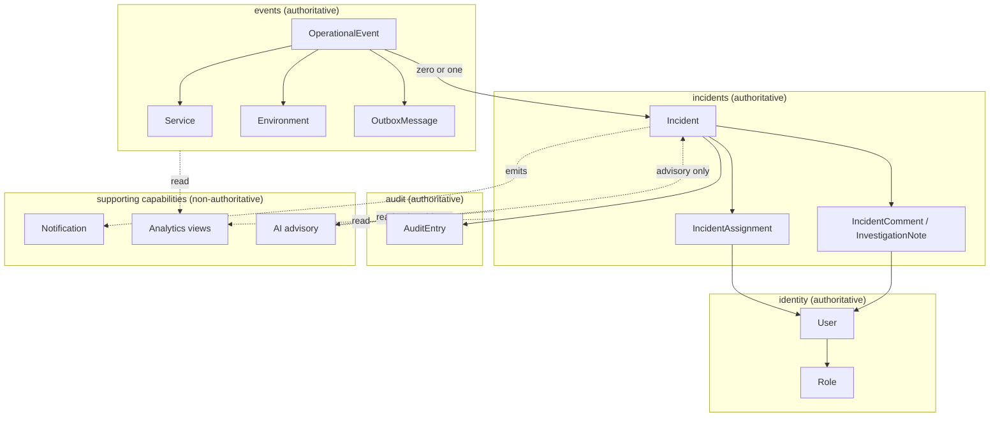

# ForgeOps — Conceptual Domain Model

Status: Foundation / pre-implementation
Related: [ARCHITECTURE.md](./ARCHITECTURE.md) · [ENGINEERING_INVARIANTS.md](./ENGINEERING_INVARIANTS.md) · [DECISIONS.md](./DECISIONS.md) · [PRD.md](./PRD.md) · [ENGINEERING_CONSTITUTION.md](./ENGINEERING_CONSTITUTION.md)

> **This is a conceptual domain model, not a database schema.** It defines domain
> concepts, ownership, relationships, identity, lifecycle, aggregates, and transaction
> boundaries. It does **not** define tables, columns, keys, indexes, or ORM mappings.
> Persistence design is a separate, later gate (see [TASKS.md](./TASKS.md)). Where a
> detail is genuinely a storage/configuration decision, it is marked as such and left
> open.
>
> This document is the **authoritative conceptual domain model**. Where the domain
> narrative in [ARCHITECTURE.md §8](./ARCHITECTURE.md#8-conceptual-domain-model) and this
> document describe the same concepts, this document governs; ARCHITECTURE.md summarizes.

---

## 1. Domain boundaries

ForgeOps modules are classified by whether they own **authoritative business state** or
provide a **supporting capability** over state owned elsewhere. Supporting capabilities
**must not** silently become alternative sources of truth.

### 1.1 Authoritative domains

| Domain | Owns (authoritative) | Reasoning |
| --- | --- | --- |
| **identity** | Users, roles | The definitive record of who may act and with what permissions; nothing else may define identity. |
| **events** | OperationalEvents, OutboxMessages, event idempotency records, Service/Environment reference data | The system of record for what was submitted and accepted, and the reliable handoff to async processing. |
| **incidents** | Incidents, incident↔event associations, assignments, comments/notes | The system of record for operational problems and their lifecycle. |
| **audit** | AuditEntries | The definitive, append-only history of significant changes. |

### 1.2 Supporting capabilities

| Capability | Consumes (does not own) | Reasoning |
| --- | --- | --- |
| **notifications** | Incident/event state changes | Emits best-effort real-time signals; the notification is not business state (SSE is non-authoritative). |
| **analytics** | Events, incidents, audit | Read-oriented views/aggregates derived from authoritative state; never a second source of truth. |
| **ai** | Incidents, events, audit/history, runbooks | Produces advisory output only; never owns or mutates authoritative state (see §17, ADR-0015). |

Rule: a supporting capability reads authoritative state through the owning domain's
interface and never persists a competing copy that other code treats as truth.

---

## 2. Core entities

Each entity lists purpose, identity, lifecycle, owner module, conceptual attributes,
relationships, invariants, and whether it is **authoritative** or **derived**. Attributes
are conceptual — not columns. Not every concept becomes a table.

### User — *authoritative* (identity)
- **Purpose:** a human or machine principal that authenticates and acts.
- **Identity:** stable, server-assigned user ID.
- **Lifecycle:** created → active → deactivated.
- **Attributes (conceptual):** identifier, credentials reference (hashed secret, never plaintext), display/name, assigned roles, status.
- **Relationships:** has one or more Roles; may be the actor on AuditEntries; may be an assignee on Incidents.
- **Invariants:** INV-SEC-001/002/004.

### Role — *authoritative* (identity)
- **Purpose:** named set of permissions attached to a user.
- **Identity:** role name (enumerated): ADMIN, ENGINEER, INCIDENT_MANAGER, VIEWER.
- **Lifecycle:** effectively static set (changes are deliberate design changes).
- **Attributes:** role name, conceptual permission set.
- **Relationships:** referenced by Users.
- **Invariants:** INV-SEC-002/005.

### Service — *authoritative reference* (events)
- **Purpose:** a software service that emits operational events (operational identity, not a cloud inventory).
- **Identity:** stable service identifier (e.g. a service key/name).
- **Lifecycle:** known/registered reference data; rarely changes.
- **Attributes:** identifier, human-readable name.
- **Relationships:** an OperationalEvent references exactly one Service (§13).
- **Invariants:** supports deterministic correlation (INV-INC via ADR-0017/0020).

### Environment — *authoritative reference* (events)
- **Purpose:** deployment context that scopes an event (e.g. production, staging).
- **Identity:** environment identifier.
- **Lifecycle:** small, mostly static set of references.
- **Attributes:** identifier, name.
- **Relationships:** an OperationalEvent references exactly one Environment (§13).
- **Invariants:** used in correlation.

### OperationalEvent — *authoritative* (events) — **aggregate root**
- **Purpose:** a validated operational signal submitted for processing.
- **Identity:** **server-generated event ID** (resource identity); a **client idempotency key** identifies the submission (§8, ADR-0016).
- **Lifecycle:** submitted → validated → accepted → processed. Content is immutable after acceptance.
- **Attributes:** event ID, idempotency key, Service reference, Environment reference, event type, normalized failure signature, severity hint, payload, timestamps, optional owning-incident reference (§6).
- **Relationships:** references one Service and one Environment; belongs to **zero or one** Incident (§6); has exactly one OutboxMessage created with it (§9).
- **Invariants:** INV-EVENT-001..007.

### OutboxMessage — *authoritative* (events) — **aggregate root** (see §9)
- **Purpose:** the committed intent to publish an event for asynchronous processing.
- **Identity:** outbox record ID, linked to the originating event.
- **Lifecycle:** PENDING → PUBLISHED (retryable on transient failure) — ADR-0019.
- **Attributes:** ID, reference to source event, payload/routing descriptor, status, attempt count, timestamps.
- **Relationships:** created in the same transaction as its OperationalEvent.
- **Invariants:** INV-OUTBOX-001..007.
- **Note:** not authoritative for *business* facts — it records intent to publish, not the business fact (INV-OUTBOX-007).

### Incident — *authoritative* (incidents) — **aggregate root**
- **Purpose:** a tracked operational problem.
- **Identity:** stable, server-assigned incident ID.
- **Lifecycle:** state machine OPEN → ACKNOWLEDGED → INVESTIGATING → MITIGATED → RESOLVED → CLOSED (§10).
- **Attributes:** incident ID, state, severity, correlation signature (service + environment + failure signature), current assignee reference, timestamps, version (for concurrency).
- **Relationships:** aggregates the OperationalEvents correlated to it (§6); has assignments (§11), comments/notes (§12), and audit entries (§14).
- **Invariants:** INV-INC-001..008.

### IncidentAssignment — *authoritative* (incidents)
- **Purpose:** record of who owns/owned an incident.
- **Identity:** assignment record (incident + assignee + time).
- **Lifecycle:** created on assignment; superseded on reassignment; historical records retained.
- **Attributes:** incident reference, assignee (User) reference, assigning actor, timestamp, optional team.
- **Relationships:** belongs to one Incident; references a User assignee.
- **Invariants:** supports INV-INC-003 (auditable) and concurrency safety (§11).
- **Representation decision:** see §11.

### IncidentComment / InvestigationNote — *authoritative* (incidents)
- **Purpose:** human investigation record on an incident.
- **Identity:** comment ID scoped to its incident.
- **Lifecycle:** appended; not silently rewritten (append-only history — §12).
- **Attributes:** comment ID, incident reference, author (User), timestamp, body, optional category.
- **Relationships:** belongs to one Incident; authored by one User.
- **Invariants:** INV-INC-008.

### AuditEntry — *authoritative* (audit)
- **Purpose:** immutable record of a significant change.
- **Identity:** audit entry ID.
- **Lifecycle:** append-only; never updated or deleted from the domain's perspective.
- **Attributes:** actor, action, resource type + resource ID, timestamp, previous value (where meaningful), new value (where meaningful), correlation/request identifier (where useful).
- **Relationships:** references the changed resource (e.g. an Incident) and the actor (User or system).
- **Invariants:** INV-INC-003/007; append-only (§14).

### Notification — *derived / non-authoritative* (notifications)
- **Purpose:** a best-effort real-time signal that something changed.
- **Identity:** ephemeral notification identifier (not durable business state).
- **Lifecycle:** emitted → delivered best-effort → discarded; not persisted as a source of truth.
- **Attributes:** subject reference (e.g. incident ID), change summary, timestamp.
- **Relationships:** derived from authoritative state changes.
- **Invariants:** INV-RT-001..004.

---

## 3. Aggregate design

Aggregates are kept minimal — only what correctness and maintainability require. DDD
terminology is used lightly, only where it clarifies transaction boundaries.

| Aggregate root | Contains | Invariants it owns | May change atomically | Must NOT be modified from outside |
| --- | --- | --- | --- | --- |
| **OperationalEvent** | The event and its accepted content | Validity, immutability of content, event identity, idempotency resolution | Event + its OutboxMessage at acceptance (one transaction) | Its accepted content (immutable); its owning-incident link is set by the incidents aggregate via the events interface, not by external writes |
| **OutboxMessage** | The publish-intent record | Atomic creation with the event; lifecycle status; retryability | Its own status/attempt updates by the publisher | Its linkage to the source event |
| **Incident** | Incident root + its assignments, comments/notes, and event associations | State-machine validity, severity presence, concurrency (version), atomic state-change-plus-audit | Incident state change + AuditEntry; adding an event association; adding an assignment/comment | Its state except through defined transitions; its associations except through the incidents interface |
| **User (identity boundary)** | User + role assignments | Authentication/authorization integrity | User status + role assignment changes | Credentials/permissions except through identity domain operations |

Notes:
- **OperationalEvent and OutboxMessage are separate aggregate roots** that are
  **created in the same transaction** (§9). They are not nested because their lifecycles
  diverge after commit: the event is business state; the outbox record is publish-intent
  driven by an independent publisher.
- The **Incident aggregate** is the consistency boundary for lifecycle, assignment,
  comments, and event association — the natural transaction boundary for incident changes.

---

## 4. Incident ↔ Event relationship

This relationship is re-analyzed here rather than inherited. The prior architecture note
described it as many-to-many; that is revised.

**Options considered:**

- **Option A — one event belongs to zero or one incident.** An event is uncorrelated
  until detection assigns it, then belongs to exactly one incident.
- **Option B — one event may contribute to multiple incidents.** (The prior many-to-many
  assumption.)
- **Option C — an explicit association concept** (a first-class link entity), enabling
  many-to-many with attributes on the link.

**Evaluation against ForgeOps requirements:**

| Criterion | Option A | Option B | Option C |
| --- | --- | --- | --- |
| Deterministic correlation | Natural: rules map an event to one active incident | Requires rules to justify multiple memberships — harder to keep deterministic | Supported but heavier |
| Auditability / explainability | "which incident owns this event?" has one clear answer | Ambiguous; audit must enumerate memberships | Clear but more moving parts |
| Query complexity | Lowest (a single owning reference) | Association table + fan-out queries | Association entity + queries |
| Domain realism | One failure signal → one operational problem | Rare in practice; usually a sign of wrong rules | Justified only if links carry attributes |
| Future extensibility | Can migrate to C later via ADR if a real need appears | — | Most flexible, but unneeded now |

**Decision: Option A** — an OperationalEvent belongs to **zero or one** Incident.
Deterministic correlation assigns each event to exactly one active incident (or creates
one); an as-yet-uncorrelated event has no incident. This is the simplest model that
satisfies the initial requirements and keeps correlation deterministic and explainable.
If a genuine many-to-many need emerges (e.g. rollup/parent incidents), Option C is
introduced later via ADR without disrupting the common case. Recorded in
[ADR-0020](./DECISIONS.md#adr-0020--event-belongs-to-zero-or-one-incident-option-a).

---

## 5. (reserved)

*Section intentionally merged into §4 and §6; kept for stable numbering with §6 below.*

---

## 6. Incident correlation domain model

Initial correlation is **deterministic, explainable, testable, and reproducible**, and
uses **no ML/AI** (ADR-0017). Given Option A (§4), correlation maps an incoming event to
**one** active incident sharing its correlation signature, or creates a new incident.

**Correlation dimensions (conceptual):**

| Dimension | Role in correlation |
| --- | --- |
| **Service** | Primary grouping: events from the same service relate. |
| **Environment** | Scopes correlation (a prod issue is not a staging issue). |
| **Normalized failure signature** | Distinguishes *different problems* within the same service/environment. |
| **Event type** | Contributes to the signature where relevant. |
| **Time window** | An event correlates to an active incident only within a bounded window; otherwise a new incident is created. |
| **Severity** | Informs the incident's severity; not itself a grouping key initially. |

**Conceptual rule:** an event correlates to an existing **active** incident when its
(service, environment, normalized failure signature) matches and it falls within the
correlation time window; otherwise detection creates a new incident.

**Open parameters (implementation/configuration decisions, not fixed here):** the exact
time-window length, the precise failure-signature normalization, and whether the window
is sliding or fixed. These are marked open (§ remaining questions) and must not be
invented arbitrarily.

---

## 7. Service and Environment model

- An **OperationalEvent references exactly one Service and exactly one Environment.** The
  two are modeled **independently** (an event points at both), not as Environment nested
  under Service — the same logical service runs in multiple environments.
- Service and Environment are **operational identity references**, deliberately minimal.
  ForgeOps is not a cloud inventory system; it does not model deployments, hosts, regions,
  or topology beyond what correlation and display require.

---

## 8. Event identity and idempotency

Three distinct identity/idempotency concepts, kept separate (not conflated):

| Concept | Question | Where it lives (authoritative) |
| --- | --- | --- |
| **Event resource identity** | "What event is this?" | Server-generated event ID in PostgreSQL |
| **Request idempotency** | "Is this the same submission being retried?" | Client idempotency key → accepted event mapping in PostgreSQL |
| **Consumer processing identity** | "Have I already applied this message's effect?" | A processed-marker / natural business key in PostgreSQL, checked by the consumer |

Relationships: the **idempotency key** protects the *submission* and resolves retries to a
single **event** (which has the resource **event ID**). The **consumer processing
identity** protects against duplicate *delivery* of the message derived from that event.
All three are authoritative in **PostgreSQL**; Redis may accelerate lookups but is never
authoritative (ADR-0016, ADR-0004). Low-level storage layout is deferred to persistence
design.

---

## 9. Outbox domain model

- **Ownership:** OutboxMessage belongs to the **events** domain. It is *not* a separate
  infrastructure boundary. Rationale: the outbox record is created transactionally with
  the OperationalEvent, is meaningful only in relation to that event, and its correctness
  is part of the events domain's guarantee (reliable acceptance-and-handoff). Treating it
  as generic infrastructure would split one atomic guarantee across two owners.
- **Identity:** outbox record ID linked to the source event.
- **Lifecycle:** PENDING → PUBLISHED, transient failure keeps it retryable (ADR-0019, §12
  of ARCHITECTURE.md).
- **Relationship to OperationalEvent:** created in the same transaction; references the
  event.
- **State / retry / publication status:** status (pending/published), attempt count, last
  attempt time; publication success means the broker accepted the message.
- **Cleanup:** old PUBLISHED records may be safely pruned (INV-OUTBOX-006).
- The publisher (an events-domain background component) updates outbox status; consumers
  elsewhere never modify outbox records.

---

## 10. Incident state machine (domain transitions)

States: **OPEN, ACKNOWLEDGED, INVESTIGATING, MITIGATED, RESOLVED, CLOSED** (no additional
states; `CANCELLED` deliberately not adopted — ARCHITECTURE.md §9). Diagram is in
[ARCHITECTURE.md §9](./ARCHITECTURE.md#9-incident-state-machine-conceptual). Every
transition is transactional and produces an AuditEntry atomically (INV-INC-007, ADR-0018).

| Transition | Preconditions | Resulting state | Side effects | Audit | Authorization |
| --- | --- | --- | --- | --- | --- |
| create → OPEN | Detected event or authorized manual creation | OPEN | Incident created; event associated (if detection) | required | Detection (system) or ENGINEER/INCIDENT_MANAGER |
| OPEN → ACKNOWLEDGED | Incident is OPEN | ACKNOWLEDGED | Responder noted | required | ENGINEER, INCIDENT_MANAGER |
| OPEN/ACKNOWLEDGED → INVESTIGATING | Prior state valid | INVESTIGATING | Investigation begins | required | ENGINEER, INCIDENT_MANAGER |
| INVESTIGATING → MITIGATED | Is INVESTIGATING | MITIGATED | Impact contained | required | ENGINEER, INCIDENT_MANAGER |
| MITIGATED → RESOLVED | Is MITIGATED | RESOLVED | Problem addressed | required | ENGINEER, INCIDENT_MANAGER |
| MITIGATED → INVESTIGATING | Is MITIGATED (regression) | INVESTIGATING | Reopened investigation | required | ENGINEER, INCIDENT_MANAGER |
| RESOLVED → CLOSED | Is RESOLVED | CLOSED | Terminal closure | required | INCIDENT_MANAGER |
| RESOLVED → INVESTIGATING | Is RESOLVED (reopened) | INVESTIGATING | Reopened | required | ENGINEER, INCIDENT_MANAGER |

Any transition not listed is **invalid and rejected** (INV-INC-002).

---

## 11. Incident assignment

**Representation decision:** assignment is modeled as **a current assignee reference on
the Incident, plus a historical IncidentAssignment record for each (re)assignment.**

- Rationale: the product needs both the **current assignee** (fast to read, part of the
  incident aggregate) and **reassignment history/auditability**. A single current field
  loses history; a pure history-only model makes "who owns it now?" a query. The hybrid is
  the simplest representation preserving both.
- The current assignee is part of the Incident aggregate; assignment changes are
  transactional and audited (INV-INC-003). Team ownership is supported as an optional
  attribute on the assignment; it is not over-modeled.
- History is retained (append-only assignment records); the current pointer is updated on
  reassignment. Recorded in
  [ADR-0021](./DECISIONS.md#adr-0021--incident-assignment-current-pointer-plus-history).

---

## 12. Comments / investigation notes

**Decision:** a **single conceptual type** (IncidentComment / InvestigationNote) with an
**optional category** (e.g. `NOTE`, `INVESTIGATION`, `RESOLUTION`), rather than distinct
types.

- Rationale: authorship, timestamps, and auditability are identical across kinds; a single
  type with categorization is the simplest model and avoids duplicate structure.
- Comments are **append-only** with respect to recorded history: they carry author and
  timestamp; investigative history is not silently rewritten (INV-INC-008). Whether
  limited editing is allowed (with audit) is deferred to persistence/API design.

---

## 13. (see §7 — Service and Environment)

*Service and Environment are defined in §7 above.*

---

## 14. Audit model

- **AuditEntry** captures: **actor** (User or system), **action**, **resource type +
  resource ID**, **timestamp**, **previous value** (where meaningful), **new value** (where
  meaningful), and a **correlation/request identifier** where useful.
- **What requires an audit entry:** every significant change — incident creation, every
  incident state transition, severity change, assignment/reassignment, resolution, and
  (as the domain grows) other authoritative mutations. Comments record their own authorship
  and time.
- Audit entries are **append-only** from the application domain's perspective (never
  updated or deleted) and are written **atomically with the change they describe**
  (INV-INC-007, ADR-0018). No SQL is defined here.

---

## 15. Notification model

- **Not authoritative business state** (INV-RT-001). A Notification reflects a change; it
  does not define it.
- **What causes a notification:** a significant authoritative state change (e.g. an
  incident created, transitioned, assigned, or resolved).
- **What it carries:** a subject reference (e.g. incident ID), a short change summary, and
  a timestamp — enough for a client to know *what* changed and then fetch authoritative
  detail via REST.
- **Relation to SSE:** notifications are delivered to connected clients over SSE
  (best-effort). SSE is the transport, not the source of truth.
- **On client disconnect:** no business state is lost; the client reconnects and re-reads
  current state via REST (INV-RT-002/003). **Durable notification persistence is not
  designed now** — requirements do not justify it. If durable/replayable notifications are
  ever required, that is a separate, ADR-worthy decision.

---

## 16. Analytics model

- Analytics is **read-oriented** and **derived** from authoritative state; it is never a
  second source of truth.
- **Initial approach: direct queries (and simple database views) over authoritative
  data.** Derived projections or precomputed aggregates are introduced **only** if a real,
  measured requirement demands them (per "no premature optimization"). The initial system
  favors simplicity.

---

## 17. AI domain boundary

- AI is a **supporting consumer** (§1.2). It may consume incidents, operational events,
  audit/history where appropriate, and runbooks/documentation.
- AI produces **advisory output** only.
- AI does **not own** Incident state, Event state, Audit state, or any authoritative
  business decision, and **must not directly mutate** authoritative domain objects. Any
  AI-derived action goes through an authorized deterministic workflow, with human
  confirmation where appropriate (ADR-0015, INV-AI-004).
- AI failure/unavailability is isolated and never degrades core correctness (INV-AI-005).

---

## 18. Conceptual domain relationship diagram

> Conceptual — **not** a physical database ERD. Boxes are domain concepts grouped by
> owning module; edges are conceptual relationships.

---

## 19. Aggregate / transaction boundary table

| Aggregate / Boundary | Owner | Atomic changes | External interaction |
| --- | --- | --- | --- |
| **OperationalEvent** | events | Event accepted **+ OutboxMessage created** in one transaction | Read via events interface; owning-incident link set through events interface |
| **OutboxMessage** | events | Status/attempt updates by the publisher | Published to RabbitMQ by the outbox publisher; not modified elsewhere |
| **Incident** | incidents | State change **+ AuditEntry**; add event association; add assignment/comment | Transitions via incidents interface; emits notifications; read by analytics/AI |
| **User / identity** | identity | User status + role assignment changes | Authentication/authorization via identity interface |
| **AuditEntry** | audit | Appended atomically with the change it records | Append-only; read by analytics/AI |

---

## 20. Domain invariant traceability

| Domain area | Invariants (see [ENGINEERING_INVARIANTS.md](./ENGINEERING_INVARIANTS.md)) |
| --- | --- |
| Event identity & idempotency | INV-EVENT-001, INV-EVENT-005; ADR-0016 |
| Event acceptance atomicity | INV-EVENT-006, INV-OUTBOX-001 |
| Outbox lifecycle | INV-OUTBOX-001..007; ADR-0019 |
| Messaging / consumers | INV-MSG-001..006; ADR-0014 |
| Incident transitions | INV-INC-002; ADR-0018 |
| Incident state + audit atomicity | INV-INC-003, INV-INC-007; ADR-0018 |
| Concurrency on incidents | INV-INC-005 |
| Event↔incident relationship | INV-INC-006; ADR-0020 |
| Assignment auditability | INV-INC-003; ADR-0021 |
| Security | INV-SEC-001..005 |
| Real-time / notifications | INV-RT-001..004 |
| AI boundary | INV-AI-001..005; ADR-0015 |

This table cross-references invariants; it does not restate them.
