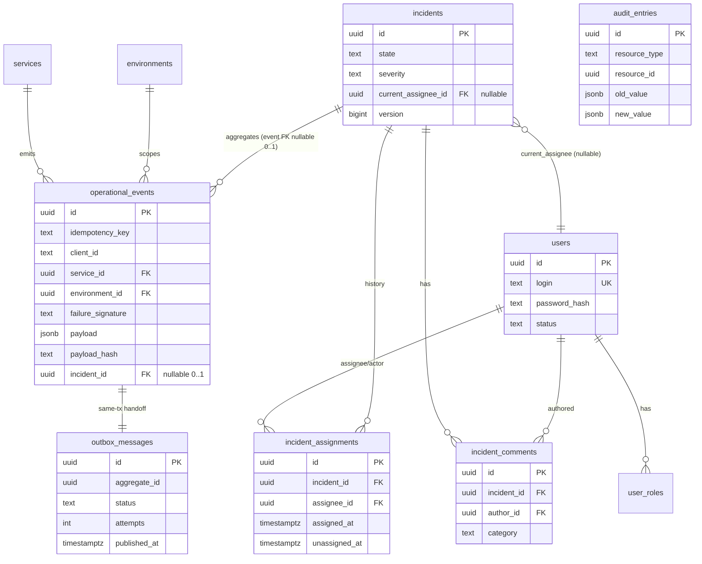

# ForgeOps — Persistence Model

Status: Foundation / pre-implementation
Related: [DOMAIN_MODEL.md](./DOMAIN_MODEL.md) · [ENGINEERING_INVARIANTS.md](./ENGINEERING_INVARIANTS.md) · [ARCHITECTURE.md](./ARCHITECTURE.md) · [DECISIONS.md](./DECISIONS.md) · [PRD.md](./PRD.md)

> **This is a persistence design, not an implementation and not a migration script.**
> It contains no SQL, no DDL, no ORM mappings, and no executable artifacts. It translates
> the approved conceptual [domain model](./DOMAIN_MODEL.md) into a durable relational
> design while preserving the established [invariants](./ENGINEERING_INVARIANTS.md).
> "Columns" here are conceptual attributes, not committed schema. Exact DDL is produced in
> a later implementation phase (see [TASKS.md](./TASKS.md)).
>
> Where this document and [DOMAIN_MODEL.md](./DOMAIN_MODEL.md) overlap, the domain model
> governs *meaning*; this document governs *durable representation*.
>
> **Implementation note (Phase 4.1):** the identity tables (`users`, `user_roles`) are the
> first to be implemented. They are created via **Flyway** SQL migrations
> ([ADR-0034](./DECISIONS.md#adr-0034--flyway-for-database-migrations)), mapped by JPA
> entities kept separate from the domain model
> ([ADR-0035](./DECISIONS.md#adr-0035--separate-jpa-entities-from-the-domain-model)), with
> Hibernate in `validate` mode so migrations own the schema.

---

## 1. Design principles

- **PostgreSQL is authoritative** for all business state ([ADR-0003](./DECISIONS.md#adr-0003--postgresql-as-the-system-of-record)).
- **Database constraints enforce invariants where practical**; application logic enforces
  what SQL reasonably cannot (§18, §26).
- Avoid redundant state; avoid premature denormalization.
- Preserve auditability; prefer explicit relationships.
- **Design indexes from actual query patterns** (§17); no index without a demonstrated
  access pattern.
- No blanket `created_at`/`updated_at` — timestamps exist only with a semantic purpose.
- **No soft deletion** unless a real requirement exists (§19).
- Derived state is not stored as authoritative unless explicitly justified.
- Not every domain concept becomes a table (e.g. Role, Notification — §3).

---

## 2. Persistence structures (overview)

| Domain concept | Representation | Rationale |
| --- | --- | --- |
| User | **table** `users` | Authoritative principal. |
| Role | **enumerated value + join table** (not a rich table) | Small fixed set; no attributes beyond the name. |
| Service | **table** `services` | Referenced by events; correlation input. |
| Environment | **table** `environments` (controlled set) | Small controlled set; referenced by events. |
| OperationalEvent | **table** `operational_events` | Authoritative event record. |
| OutboxMessage | **table** `outbox_messages` | Transactional handoff record. |
| Incident | **table** `incidents` | Authoritative incident root. |
| IncidentAssignment | **table** `incident_assignments` (history) + current pointer on `incidents` | History + fast current read (ADR-0021). |
| IncidentComment / InvestigationNote | **table** `incident_comments` | Append-oriented notes. |
| AuditEntry | **table** `audit_entries` | Append-only history. |
| Notification | **no table** | Best-effort, non-authoritative (§22). |

The following sections detail each. Data types are conceptual; see §24.

---

## 3. User and Role model

**`users`** — authoritative (identity)
- **PK:** `id` (UUID, server-generated).
- **Columns (conceptual):** `id`, `username`/`email` (login identifier), `password_hash`
  (salted one-way hash — never plaintext), `display_name`, `status` (ACTIVE / DEACTIVATED),
  `created_at` (semantic: account creation).
- **Constraints:** unique login identifier; `password_hash` NOT NULL; `status` restricted
  to allowed values.
- **Lifecycle:** created → active → deactivated (no hard delete; see §19).

**Roles** — roles are a **small fixed enumerated set** (ADMIN, ENGINEER,
INCIDENT_MANAGER, VIEWER). They have no attributes beyond their name, so a rich `roles`
table adds nothing. Represented as:
- **`user_roles`** join table — **PK:** (`user_id`, `role`); `role` is a constrained
  enumerated value; `user_id` FK → `users(id)`.
- **Users can have multiple roles** (many roles per user). Uniqueness of (`user_id`,
  `role`) prevents duplicates.
- A normalized `roles` reference table is deliberately **not** created; if roles ever gain
  attributes (description, permission sets stored as data), that becomes an ADR-worthy
  change.

*No authentication/JWT implementation is designed here.*

---

## 4. Service and Environment model

**`services`** — **PK:** `id` (UUID); columns: `key` (stable unique service key/name,
unique), `display_name`. 

**`environments`** — **PK:** `id` (UUID); columns: `key` (e.g. `production`, `staging`,
unique). Environment is a **controlled set** — few rows, managed as reference data.

- Both are **independent tables**; an `operational_events` row references **both** (one
  service, one environment) — they are not nested (§7 of DOMAIN_MODEL: a service runs in
  multiple environments).
- The **operational identity** relevant to correlation is (service, environment, failure
  signature) — expressed on the event, not as a separate "service-environment" table.
- No modeling of deployments, regions, clusters, or hosts — out of scope per requirements.

---

## 5. OperationalEvent model

**`operational_events`** — authoritative (events); **aggregate root**.

| Attribute | Purpose | Notes |
| --- | --- | --- |
| `id` (UUID) | **Resource identity** (server-generated) | PK; authoritative event identity (INV-EVENT-001). |
| `producer_event_id` (text, optional) | Producer/client-supplied event identifier | Optional; for traceability to the source system. |
| `idempotency_key` (text, optional) | **Request idempotency** | Scoped per authenticated client; required for reliable retry (§6). |
| `client_id` (identifier) | The **authenticated submitting client** (a User principal) | Scopes the idempotency key; no tenancy (§6). |
| `service_id` (FK) | Emitting service | → `services(id)`. |
| `environment_id` (FK) | Scoping environment | → `environments(id)`. |
| `event_type` (text/enum) | Kind of operational signal | Correlation input. |
| `severity` (enum) | Severity hint | Informs incident severity. |
| `failure_signature` (text) | Normalized failure signature | Correlation input (§21). |
| `occurred_at` (timestamptz) | When the event happened at source | Timezone-aware. |
| `received_at` (timestamptz) | When accepted by ForgeOps | Distinct from `occurred_at`. |
| `payload` (JSONB) | Structured event content | Flexible; see §24, §29. |
| `payload_hash` (text) | Deterministic hash of the **canonicalized** payload | Used for same-key payload-equality checks (§6). |
| `processing_state` (enum) | RECEIVED / PROCESSED (only if justified) | See note below. |
| `incident_id` (FK, nullable) | Owning incident | 0..1 (§8); nullable = uncorrelated. |

- **`processing_state`** is included **only** to record whether asynchronous processing
  has applied this event's effect (supporting consumer idempotency, §7). If consumer
  idempotency is expressed by a natural business key instead, this column is dropped — a
  point deferred to implementation, not force-added.
- Event **content is immutable after acceptance** (INV-EVENT-004); only `incident_id` and
  (if present) `processing_state` may change post-acceptance — both are processing-derived,
  not content.

---

## 6. Event identity and idempotency constraints

Three distinct identifiers (never conflated — [ADR-0016](./DECISIONS.md#adr-0016--separate-event-resource-identity-from-request-idempotency)):

| Identifier | Meaning | Mandatory? | Scope | Uniqueness constraint |
| --- | --- | --- | --- | --- |
| `id` (resource identity) | "What event is this?" | **Yes** (server-generated) | Global | PK |
| `producer_event_id` | Source system's own ID | Optional | Per client | Optional unique (`client_id`, `producer_event_id`) if used |
| `idempotency_key` (request idempotency) | "Is this the same submission retried?" | **Optional; required for reliable retry** | Per authenticated client | **Unique (`client_id`, `idempotency_key`)** |

**Scope (ADR-0025).** The idempotency key is scoped to the **authenticated submitting
client** (a User principal, human or machine) — an existing ForgeOps concept. **ForgeOps
is not multi-tenant; no tenant concept is introduced.** The **client supplies** the key
and owns its namespace. The key is **optional**, but without it a retry cannot be
recognized and may create a distinct event.

**Payload equality.** "Same payload" is determined by a **deterministic hash of the
canonicalized payload** (`payload_hash`) — stable field ordering and formatting — **not**
by raw JSON string comparison (which would flag formatting/ordering differences as false
conflicts). Equality compares `payload_hash`.

**Behavior for the critical cases** (PostgreSQL is authoritative; Redis may only
accelerate the lookup and never decides correctness):

- **Same key + same payload (equal `payload_hash`):** treated as a **retry**. The unique
  (`client_id`, `idempotency_key`) constraint means the second insert conflicts; the
  system resolves to the **already-accepted event** and returns it. **No new event, no new
  outbox record, no duplicate effect** (INV-EVENT-005).
- **Same key + different payload (different `payload_hash`):** a **conflict**. The key was
  already used for a different submission. The system **rejects** the request rather than
  overwriting or silently accepting; the original accepted event is unchanged.
- **Original already processed:** the retry still resolves to the same event; processing
  is idempotent (INV-MSG-003), so no duplicate effect occurs.
- **Original still pending processing:** the retry resolves to the same event; the
  original outbox record drives exactly one logical processing — no second outbox record.

Because the constraint is scoped to `client_id`, **independent clients using the same key
value never collide**. (HTTP status codes are deferred to API contract design.)

Retention: the (`client_id`, `idempotency_key`) → event mapping must be retained at least
as long as clients may retry. Because the key lives on the authoritative
`operational_events` row, retention is naturally tied to event retention (events are not
deleted — §19); no separate expiry is required for correctness. A Redis cache of recent
keys/hashes, if used, is a non-authoritative accelerator with its own TTL.

---

## 7. Event → Incident cardinality

The approved model is **an OperationalEvent belongs to zero or one Incident**
([ADR-0020](./DECISIONS.md#adr-0020--event-belongs-to-zero-or-one-incident-option-a)); an
incident contains many events.

- Represented by a **nullable `incident_id` FK on `operational_events`** → `incidents(id)`.
- `NULL` = not yet correlated; a set value = the single owning incident.
- **One-to-many (incident → events)** falls out naturally: many event rows reference the
  same incident.
- **No association/junction table** and **no many-to-many** — reintroducing that would
  require changing the approved domain model (Option C via a new ADR).

---

## 8. Incident persistence model

**`incidents`** — authoritative (incidents); **aggregate root**.

| Attribute | Purpose |
| --- | --- |
| `id` (UUID) | Identity (PK). |
| `title` / `summary` (text) | Human-readable description. |
| `service_id` (FK) | Service context (→ `services`). |
| `environment_id` (FK) | Environment context (→ `environments`). |
| `failure_signature` (text) | Correlation signature shared by its events (§21). |
| `severity` (enum) | Current severity (always present — INV-INC-004). |
| `state` (enum) | Lifecycle state (§10). |
| `current_assignee_id` (FK, nullable) | Fast current-owner read (→ `users`; §11). |
| `version` (integer/bigint) | **Optimistic-lock token** for concurrency (INV-INC-005). |
| `created_at` (timestamptz) | Creation time. |
| `resolved_at` (timestamptz, nullable) | Set when RESOLVED. |
| `closed_at` (timestamptz, nullable) | Set when CLOSED. |

- No ticketing-system fields are added without a domain reason. Lifecycle timestamps are
  limited to semantically meaningful moments (`created_at`, `resolved_at`, `closed_at`);
  the full per-transition history lives in `audit_entries` (§13), not as columns.
- `current_assignee_id` is a denormalized pointer justified by the read pattern (ADR-0021);
  the authoritative assignment history is `incident_assignments` (§11).

---

## 9. Incident state persistence

- `state` is a **constrained enumerated value** (OPEN, ACKNOWLEDGED, INVESTIGATING,
  MITIGATED, RESOLVED, CLOSED).
- **Database can enforce:** that `state` is one of the allowed values (a CHECK/enum). This
  prevents nonsense values.
- **Database cannot reasonably enforce:** which *transitions* are legal (e.g. that
  RESOLVED→CLOSED is allowed but OPEN→CLOSED is not). Transition legality is an
  **application-enforced** invariant (INV-INC-002), validated against the current `state`
  within the transactional state-change operation.
- **Lifecycle timestamps:** rather than a column per state, meaningful moments are captured
  as dedicated columns (`resolved_at`, `closed_at`) plus the append-only `audit_entries`
  trail, which records every transition with actor and time. This avoids a wide, mostly
  NULL set of `*_at` columns while preserving full history.

---

## 10. Assignment history

Per [ADR-0021](./DECISIONS.md#adr-0021--incident-assignment-current-pointer-plus-history):
**current pointer + history.**

- **Current:** `incidents.current_assignee_id` (nullable FK → `users`).
- **History table `incident_assignments`:**

| Attribute | Purpose |
| --- | --- |
| `id` (UUID) | PK. |
| `incident_id` (FK) | → `incidents(id)`. |
| `assignee_id` (FK) | Assigned user (→ `users`). |
| `assigned_by` (FK) | Actor performing the assignment (→ `users`). |
| `assigned_at` (timestamptz) | When assigned. |
| `unassigned_at` (timestamptz, nullable) | When superseded/ended, if tracked. |
| `team` (text, optional) | Optional team ownership. |

- **Reassignment semantics:** on reassignment, the current record's `unassigned_at` is set,
  a new record is inserted, and `incidents.current_assignee_id` is updated — all in one
  transaction, with an audit entry.
- **No `teams` entity** is introduced; `team` is an optional attribute. A first-class team
  entity is deferred unless requirements justify it.

---

## 11. Comments / investigation notes

**`incident_comments`** — one type with optional categorization (DOMAIN_MODEL §12).

| Attribute | Purpose |
| --- | --- |
| `id` (UUID) | PK. |
| `incident_id` (FK) | → `incidents(id)`. |
| `author_id` (FK) | → `users(id)`. |
| `category` (enum, optional) | NOTE / INVESTIGATION / RESOLUTION. |
| `body` (text) | Content. |
| `created_at` (timestamptz) | Authorship time. |

- **Editability:** initial policy is **append-only / immutable content** (no edit) to keep
  investigative history trustworthy. If limited editing is later required, it must be
  audited; no complex versioning is introduced now.

---

## 12. Audit entry model

**`audit_entries`** — authoritative (audit); **append-only** from the application domain
perspective (INV-INC-003/007).

| Attribute | Purpose |
| --- | --- |
| `id` (UUID) | PK. |
| `actor_id` (FK, nullable) | Who acted (→ `users`); NULL/system sentinel for system actions. |
| `actor_type` (enum) | USER / SYSTEM. |
| `action` (text/enum) | What happened (e.g. INCIDENT_STATE_CHANGED). |
| `resource_type` (text/enum) | e.g. INCIDENT, EVENT. |
| `resource_id` (UUID) | The changed resource. |
| `occurred_at` (timestamptz) | When. |
| `old_value` (JSONB, nullable) | Previous state/values where meaningful. |
| `new_value` (JSONB, nullable) | New state/values where meaningful. |
| `correlation_id` (text, nullable) | Request/correlation identifier where useful. |

- **JSONB for `old_value`/`new_value`** is appropriate: audited resources differ in shape,
  and the audit payload is flexible, read-mostly context — a rigid column-per-field model
  would not generalize. JSONB keeps the trail uniform and queryable.
- **Append-only** is an application-domain rule; §18/§26 explain how far the database can
  enforce it (inserts only; no UPDATE/DELETE from the domain path).

---

## 13. Outbox model

**`outbox_messages`** — minimal, per [ADR-0019](./DECISIONS.md#adr-0019--outbox-lifecycle-pending--published-with-retryable-failure).

| Attribute | Purpose |
| --- | --- |
| `id` (UUID) | PK. |
| `message_type` (text/enum) | Routing/type of the message. |
| `aggregate_type` (text) | Resource kind (e.g. OPERATIONAL_EVENT). |
| `aggregate_id` (UUID) | Source resource reference (e.g. the event `id`). |
| `payload` (JSONB) | The message body to publish. |
| `status` (enum) | PENDING / PUBLISHED. |
| `attempts` (integer) | Retry counter. |
| `created_at` (timestamptz) | Creation (= event acceptance time). |
| `published_at` (timestamptz, nullable) | Set on successful publication. |
| `next_attempt_at` (timestamptz, nullable) | Earliest next try (backoff), if used. |
| `last_error` (text, nullable) | Last failure detail for diagnostics. |

- Only two real states (**PENDING**, **PUBLISHED**); "FAILED/RETRYABLE" is simply PENDING
  with `attempts > 0` and a `next_attempt_at`, avoiding an extra state (ADR-0019).
- Supports pending publication, retry (attempts + backoff), successful publication, safe
  concurrent claiming (§14), and cleanup (§15).

---

## 14. Outbox concurrency

**Question:** how do multiple publisher workers/threads (now within one deployable,
possibly several instances later) claim pending records without double-work or blocking?

**Mechanisms evaluated:**
- *Plain `SELECT ... WHERE status='PENDING'` then update:* two workers can grab the same
  row → duplicate publication and contention.
- *Coarse table/advisory lock:* serializes publishing; safe but a needless bottleneck.
- *`SELECT ... FOR UPDATE` (blocking):* correct but workers block each other on contended
  rows.
- *`SELECT ... FOR UPDATE SKIP LOCKED`:* each worker locks and claims a batch of pending
  rows, skipping rows already locked by peers — no blocking, no double-claim.

**Decision:** claim pending records with **`FOR UPDATE SKIP LOCKED`** over a batch ordered
by eligibility (`status='PENDING'` and `next_attempt_at` due), publish, then mark
`PUBLISHED` within the same transaction. This is the simplest mechanism that is correct for
a single instance today and remains safe if multiple instances run later. Duplicate
publication is still *possible* (crash between broker-accept and status update) and is
tolerated by idempotent consumers (INV-MSG-003) — the claim strategy reduces duplicates,
it does not need to eliminate them. Recorded in
[ADR-0022](./DECISIONS.md#adr-0022--claim-outbox-rows-with-for-update-skip-locked).

---

## 15. Outbox retention

- **PUBLISHED rows are retained** for a bounded period for observability, debugging, and
  reconciliation, then pruned.
- **Cleanup mechanism (conceptual):** a periodic job deletes PUBLISHED rows older than a
  retention window.
- **Safety condition before deletion:** a row may be deleted only if `status = PUBLISHED`
  and `published_at` is older than the retention window. **PENDING rows are never deleted
  automatically** (that would drop unpublished work — a data-loss bug). FAILED-but-pending
  rows likewise remain until published or explicitly triaged.
- **Duration is configurable, not hardcoded** — no arbitrary period is committed here; the
  default is an implementation/configuration decision.
- **ForgeOps v1 implementation decision (Phase 6 Slice 4):** retention window **7 days**
  (`PT168H`), cleanup cadence **hourly** (`PT1H` fixed delay), delete **500 rows per batch**;
  enabled by default. All are configuration-driven (`forgeops.outbox.cleanup.{enabled,
  retention,fixed-delay,batch-size}`) and overridable per environment; non-positive values
  fall back to these defaults. Eligibility timestamp is `published_at`; deletion is bounded
  and repeated until no eligible rows remain, each batch in its own transaction. These are
  operational defaults, not an architectural change — the safety model above is unchanged.

---

## 16. Index design

Each index is tied to an expected access pattern; nothing speculative.

### `operational_events`
| Index | Supports |
| --- | --- |
| PK (`id`) | Lookup by resource identity. |
| unique (`client_id`, `idempotency_key`) | Idempotent submission resolution (§6). |
| optional unique (`client_id`, `producer_event_id`) | Source-ID traceability (only if used). |
| (`service_id`, `environment_id`, `received_at`) | Events by service/env over time; correlation queries. |
| (`incident_id`) | Fetch all events for an incident (0..1 → many). |
| (`processing_state`) partial where not PROCESSED | Find unprocessed events (only if `processing_state` kept). |

### `incidents`
| Index | Supports |
| --- | --- |
| PK (`id`) | Lookup by ID. |
| (`state`) | Dashboards: open/active incidents. |
| (`service_id`, `environment_id`, `created_at`) | Incidents by context over time. |
| (`severity`, `state`) | Prioritized active views. |
| (`current_assignee_id`) partial where assigned | "My incidents" views (only if that view exists). |

### `outbox_messages`
| Index | Supports |
| --- | --- |
| PK (`id`) | Lookup. |
| (`status`, `next_attempt_at`) partial where `status='PENDING'` | The hot "claim due pending rows" query (§14). |
| (`published_at`) partial where `status='PUBLISHED'` | Retention cleanup (§15). |

### `audit_entries`
| Index | Supports |
| --- | --- |
| PK (`id`) | Lookup. |
| (`resource_type`, `resource_id`, `occurred_at`) | Full history of a given resource. |
| (`actor_id`, `occurred_at`) | Actions by an actor over time. |

Composite ordering is chosen so the most selective/equality columns lead (e.g. status
before time on outbox). Indexes marked "only if" are added **only** when the corresponding
query is actually built.

---

## 17. Constraint design

**Database-enforceable invariants:**
- **Primary keys** on every table.
- **Foreign keys:** event→service/environment/incident; incident→current assignee;
  assignment→incident/users; comment→incident/author; audit→resource is a soft reference
  (see below).
- **Unique:** (`client_id`, `idempotency_key`) on events; unique login on users; unique
  `key` on services/environments; (`user_id`, `role`) on user_roles.
- **NOT NULL:** identities, `password_hash`, event `service_id`/`environment_id`/
  `received_at`, incident `severity`/`state`, audit `action`/`resource_type`/`resource_id`/
  `occurred_at`.
- **Valid value/state:** enum/CHECK on `state`, `severity`, `status`, `category`.
- **Event→incident cardinality:** the single nullable `incident_id` FK *structurally*
  enforces 0..1 (a row cannot reference two incidents).

**Application-enforced invariants (SQL cannot reasonably do these):**
- **State-machine transition legality** (INV-INC-002) — validated against current state.
- **State change + audit atomicity** (INV-INC-007) — enforced by wrapping both writes in
  one transaction (§18), not by a constraint.
- **Append-only audit** — enforced by the domain never issuing UPDATE/DELETE on
  `audit_entries`; optionally hardened later with DB-level revocation of update/delete or a
  guard, but not claimed as a plain constraint.
- **Idempotency conflict semantics** (same key/different payload → reject, §6) — the unique
  constraint detects the collision; payload equality is decided by `payload_hash`; the
  *decision* to reject vs return is application logic. Because the constraint is scoped to
  (`client_id`, `idempotency_key`), it **cannot reject legitimate requests from
  independent clients** that happen to use the same key value.
- **`audit_entries.resource_id`** references multiple resource types, so it is **not** a
  single FK; referential soundness is an application responsibility (a polymorphic
  reference).

The document does **not** claim SQL enforces state-machine semantics; it explicitly does
not.

---

## 18. Transaction boundaries (persistence-level atomicity)

Database-level consistency requirements (no framework annotations prescribed):

| Operation | Must commit atomically |
| --- | --- |
| **Event acceptance** | insert `operational_events` row **+** insert `outbox_messages` row (INV-OUTBOX-001, INV-EVENT-006). |
| **Incident transition** | update `incidents` (state, version, lifecycle timestamps) **+** insert `audit_entries` (INV-INC-007, ADR-0018). Optimistic-lock check on `version` occurs here. |
| **Event processing → incident create/update** | the incident insert/update **+** required `audit_entries` insert **+** the event's `incident_id`/`processing_state` update **+** any follow-on `outbox_messages` insert — all in one transaction. |
| **Reassignment** | update `incidents.current_assignee_id` **+** close prior + insert new `incident_assignments` **+** insert `audit_entries`. |

Each boundary is "all or nothing": a partial write must never be observable as committed.

---

## 19. Delete / mutability policy

| Object | Policy | Notes |
| --- | --- | --- |
| `operational_events` | **Immutable content; append-only; not deleted** | Only `incident_id`/`processing_state` change post-acceptance (derived, not content). |
| `outbox_messages` | **Mutable status; retention-managed delete** | PENDING never auto-deleted; PUBLISHED pruned after window (§15). |
| `audit_entries` | **Append-only; never updated/deleted** by the domain | Trustworthy history (INV-INC-003). |
| `incidents` | **Mutable** (state, assignee, timestamps, version) | Never hard-deleted; closure is a state, not a delete. |
| `incident_comments` | **Append-only content** | No edit initially (§11). |
| `incident_assignments` | **Append + close** | History retained; `unassigned_at` set on supersede. |
| `users` | **Mutable** (status, roles) | Deactivated, not deleted (preserves audit references). |
| `services` / `environments` | **Mutable reference data** | Rarely change. |

**No soft-delete flags** are introduced anywhere; where "not deleted" is required, the row
simply persists (events, audit) or uses a real status (users: DEACTIVATED; incidents:
CLOSED). This avoids soft-delete complexity with no requirement behind it.

---

## 20. Correlation persistence

Deterministic correlation ([ADR-0017](./DECISIONS.md#adr-0017--deterministic-rule-based-initial-incident-correlation))
needs only data **already** persisted:
- from the event: `service_id`, `environment_id`, `event_type`, `failure_signature`,
  `occurred_at`/`received_at`;
- from incidents: `state` (to find an **active** incident), `failure_signature`,
  `service_id`, `environment_id`.

The matching incident is found by querying active incidents with the same
(service, environment, failure signature) within the time window (supported by the
incident indexes in §16). **No separate correlation-state table** is created — it would
duplicate authoritative data. **No ML, no vector database.**

---

## 21. Notification persistence

**No durable notification table.** Notifications are best-effort, non-authoritative signals
delivered over SSE (INV-RT-001/004). Their content is fully derivable from authoritative
state, and clients recover current state via REST after a disconnect (INV-RT-002/003).
Persisting them would create non-authoritative state with no requirement behind it. If
durable/replayable notifications are ever required, that is a separate, ADR-worthy
decision.

---

## 22. Analytics persistence

Analytics is read-oriented and derived (DOMAIN_MODEL §16). Initially served by:
- **direct queries** over `operational_events`, `incidents`, `audit_entries`;
- the **indexes** in §16;
- optionally, **database views** for convenience (views are query definitions, not stored
  authoritative state).

**No analytics tables and no materialized projections** are created unless a *measured*
requirement justifies them (per "no premature optimization").

---

## 23. Data types and identifiers

| Concern | Recommended type | Why |
| --- | --- | --- |
| IDs | **UUID v7** (time-ordered, server-generated) | Stable, non-guessable, safe to expose, no sequence coupling; time-ordered prefix gives good index-insert locality on append-heavy tables and chronologically sortable keys ([ADR-0023](./DECISIONS.md#adr-0023--uuid-primary-keys-for-domain-entities-time-ordered--uuid-v7)). |
| Timestamps | **timestamptz** | Timezone-aware; events/audit span sources and zones — required for correctness (INV correctness of ordering). |
| Severity / state / status / category | **enum or text + CHECK** | Small controlled sets; DB validates the value domain. |
| JSON payloads (`payload`, audit `old/new_value`) | **JSONB** | Flexible, queryable, indexable; heterogeneous shapes ([ADR-0024](./DECISIONS.md#adr-0024--jsonb-for-flexible-payload-and-audit-values)). |
| Textual fields (title, body, signature) | **text** | No arbitrary length limits; PostgreSQL `text` is efficient. |
| Version (optimistic lock) | **bigint/integer** | Monotonic counter for optimistic concurrency (INV-INC-005). |
| Attempt counter | **integer** | Small non-negative counter. |

`timestamptz` is preferred for all event and audit temporal data.

---

## 24. Domain → persistence traceability

| Domain concept | Persistence representation | Owner | Key invariants | Notes |
| --- | --- | --- | --- | --- |
| User | `users` (+ `user_roles`) | identity | INV-SEC-* | Deactivated, not deleted. |
| Role | enumerated `role` in `user_roles` | identity | INV-SEC-002 | No rich table. |
| Service | `services` | events | correlation | Reference data. |
| Environment | `environments` | events | correlation | Controlled set. |
| OperationalEvent | `operational_events` | events | INV-EVENT-* | Immutable content. |
| OutboxMessage | `outbox_messages` | events | INV-OUTBOX-* | Same-tx with event. |
| Incident | `incidents` | incidents | INV-INC-* | Aggregate root; `version` for concurrency. |
| IncidentAssignment | `incident_assignments` + `incidents.current_assignee_id` | incidents | INV-INC-003 | ADR-0021. |
| IncidentComment / Note | `incident_comments` | incidents | INV-INC-008 | Append-only. |
| AuditEntry | `audit_entries` | audit | INV-INC-003/007 | Append-only; JSONB values. |
| Notification | *(none)* | notifications | INV-RT-* | Not persisted (§21). |

Every authoritative domain concept has a clear representation; the only non-persisted
concept (Notification) is non-authoritative by design.

---

## 25. Domain → invariant → database enforcement matrix

| Invariant | Database enforcement | Application enforcement | Test requirement |
| --- | --- | --- | --- |
| INV-EVENT-001 (unique event identity) | PK on `operational_events.id` | ID generation on acceptance | Duplicate ID impossible. |
| INV-EVENT-005 (request idempotency) | unique (`client_id`, `idempotency_key`) | resolve retry vs conflict via `payload_hash` (§6) | Same key/same payload → one event; same key/diff payload → reject; independent clients with same key value do not collide. |
| INV-EVENT-006 / INV-OUTBOX-001 (event+outbox atomic) | (both writes in one tx) | single transaction boundary (§18) | Forced failure leaves neither row. |
| INV-EVENT-004 (event content immutable) | — | no UPDATE of content columns | Attempted content change is rejected. |
| INV-OUTBOX-002/003 (eventual, retryable publish) | status/attempt columns | publisher retry loop | Broker outage → PENDING → publishes on recovery. |
| INV-MSG-003 (idempotent consumers) | `processing_state`/natural key uniqueness (where used) | dedup check before effect | Duplicate delivery → no duplicate effect. |
| INV-INC-002 (valid transitions only) | enum limits *values* only | transition validation vs current state | Invalid transition rejected. |
| INV-INC-005 (no lost update) | `version` column | optimistic-lock check in tx | Concurrent updates: one wins, other retries; no silent overwrite. |
| INV-INC-007 (state change + audit atomic) | (both writes in one tx) | single transaction boundary (§18) | Neither commits without the other. |
| INV-INC-008 (notes append-only) | insert-only usage | no edit path initially | History not silently rewritten. |
| Append-only audit | insert-only usage (optionally hardened) | domain never updates/deletes | No UPDATE/DELETE on audit from domain. |
| INV-RT-001 (SSE non-authoritative) | no notification table | state served from PostgreSQL | SSE loss → state recoverable via REST. |
| INV-AI-004 (AI cannot mutate) | AI has no write path to these tables | writes only via authorized workflows | AI output cannot change incident rows directly. |

No invariant is claimed database-enforced unless it genuinely is; state-machine legality
and cross-row atomicity are explicitly application/transaction responsibilities.

---

## 26. Conceptual relational diagram

> Conceptual — **not** executable SQL. Shows major tables, conceptual PKs, and key FK
> relationships including event→incident 0..1, incident→assignment history, and
> event→outbox.

`audit_entries` is intentionally not FK-linked to a single parent (polymorphic
`resource_type` + `resource_id`, §17).

---

## 27. Performance and scale discipline

No numeric targets are invented. Identified concerns:

- **Likely hot query:** outbox "claim due pending rows" (§14) — mitigated by the partial
  index on (`status`, `next_attempt_at`).
- **Likely growing tables:** `operational_events`, `audit_entries`, and PUBLISHED
  `outbox_messages` — the first two grow with usage; outbox growth is bounded by retention
  (§15).
- **Likely expensive queries:** time-range analytics over events/incidents — mitigated by
  the context+time composite indexes (§16); revisited with real measurements.
- **Future partitioning/archival:** `operational_events` and `audit_entries` are the only
  plausible candidates and **only if measurement shows a need**. No partitioning is
  designed now (avoiding premature optimization).

---

## 28. Security / data handling

- **Credentials:** only a salted one-way `password_hash` is stored; **never plaintext**.
- **Secrets:** never stored in the system of record; supplied via configuration/environment
  (INV-SEC-004). Secrets must not be placed into event payloads intentionally.
- **Sensitive operational payloads:** `payload` JSONB may contain operational detail;
  producers should avoid embedding secrets. **Payload sensitivity/redaction is flagged as a
  future design consideration**, not solved with an invented encryption architecture now.
- **Audit data:** append-only and access-controlled; it may reference actors and resources
  but should not duplicate secrets.

These are design considerations recorded for the security phase, not implementation.
