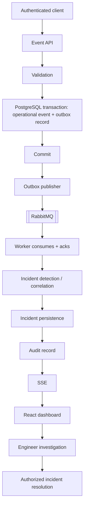

# ForgeOps — Product Requirements Document (PRD)

Status: Foundation / pre-implementation
Owner: ForgeOps engineering
Related: [ENGINEERING_CONSTITUTION.md](./ENGINEERING_CONSTITUTION.md) · [ARCHITECTURE.md](./ARCHITECTURE.md) · [DECISIONS.md](./DECISIONS.md) · [ENGINEERING_INVARIANTS.md](./ENGINEERING_INVARIANTS.md) · [TASKS.md](./TASKS.md)

> This document defines *what* ForgeOps is and *what it must do*. It does not describe
> implementation. The intended technical shape lives in [ARCHITECTURE.md](./ARCHITECTURE.md),
> and the rules governing how work is done live in the
> [Engineering Constitution](./ENGINEERING_CONSTITUTION.md).

---

## 1. Product mission

ForgeOps is a production-grade **Engineering Operations & Incident Intelligence
Platform**. It helps engineering teams turn raw operational signals into managed,
auditable incidents, and gives them real-time visibility into what is happening across
their services.

The platform enables teams to:

1. ingest operational events from software services;
2. validate, persist, and asynchronously process those events;
3. detect and correlate operational problems;
4. create and manage incidents;
5. assign and collaborate on incidents;
6. maintain a reliable audit trail;
7. provide real-time operational visibility;
8. expose system health and performance metrics;
9. support reliable processing through idempotency, retries, and failure handling;
10. eventually provide an evidence-grounded, AI-assisted incident investigation
    capability.

The deterministic platform is the product. AI is a secondary, optional capability that
must never be required for the core platform to be useful and correct.

---

## 2. Target users

| User | Description | Primary needs |
| --- | --- | --- |
| **Software / SRE engineer** | Operates services and responds to incidents | Fast visibility, reliable event flow, clear incident state, collaboration |
| **On-call responder** | First line during an operational problem | Real-time updates, severity clarity, assignment, investigation notes |
| **Engineering lead** | Oversees operational health | Metrics, audit trail, incident history |
| **Automated system / service** | Emits operational events | Simple, authenticated, idempotent ingestion API |

The system serves both **human users** (dashboard, collaboration) and
**machine clients** (event ingestion).

---

## 3. Core problems being solved

1. Operational signals are scattered and unstructured, making it hard to know what is
   actually happening.
2. Events arrive unreliably — duplicated, malformed, or in bursts — and naive handling
   loses or corrupts data.
3. Detecting that "something is wrong" and turning it into an owned, tracked incident
   is often manual and inconsistent.
4. Incident state, ownership, and history are frequently lost or untrustworthy.
5. Teams lack a reliable, auditable, real-time view of operational reality.

---

## 4. Scope (what ForgeOps will be)

### 4.1 In scope — core platform capabilities

These capabilities must eventually exist in the core platform.

**Identity**
- registration and login
- secure password storage
- JWT-based authentication
- role-based authorization

**Operational events**
- event ingestion API
- validation
- persistence
- deduplication / idempotency
- asynchronous processing

**Incident management**
- incident creation
- incident lifecycle (state machine)
- severity
- assignment
- comments / investigation notes
- resolution
- audit history

**Reliability**
- transactions
- concurrency protection
- idempotent processing
- retry handling
- dead-letter handling
- rate limiting

**Real-time experience**
- live incident updates

**Observability**
- application health
- metrics
- meaningful operational metrics

**Testing**
- unit tests
- integration tests
- concurrency tests
- end-to-end tests
- reproducible performance / load tests

### 4.2 Secondary scope — AI (optional)

An evidence-grounded, AI-assisted incident investigation capability. Governed by the AI
rules in the [Engineering Constitution](./ENGINEERING_CONSTITUTION.md#8-ai-development-rules).
It is optional and must not be a dependency of the core platform.

---

## 5. Non-goals

ForgeOps must not become an uncontrolled enterprise clone. The following are explicitly
out of scope. Every future feature requires a documented engineering or product
justification before it is considered.

- a full PagerDuty clone
- a full Datadog clone
- a full e-commerce platform
- a complete cloud platform
- a Kubernetes platform
- dozens of microservices
- mobile applications
- unnecessary third-party integrations
- unnecessary infrastructure
- unnecessary UI features
- payment processing
- complex billing
- social networking features
- blockchain functionality
- features added only for resume keywords

---

## 6. Functional requirements

Requirements are grouped by domain. IDs are stable references for later specs and tests.
Priorities: **M** = must (core), **S** = secondary/optional.

The **properties these requirements must always preserve** — event, outbox, messaging,
incident, security, real-time, and AI invariants — are specified with stable IDs in
[ENGINEERING_INVARIANTS.md](./ENGINEERING_INVARIANTS.md). The conceptual domain model,
incident state machine, transaction boundaries, idempotency model, and failure semantics
are in [ARCHITECTURE.md](./ARCHITECTURE.md). This section stays focused on product
requirements and does not restate those documents.

### 6.1 Identity (FR-ID)
| ID | Requirement | Priority |
| --- | --- | --- |
| FR-ID-1 | Users can register with credentials | M |
| FR-ID-2 | Passwords are stored using a secure, salted one-way hash | M |
| FR-ID-3 | Users can authenticate and receive a JWT | M |
| FR-ID-4 | Protected endpoints require a valid token | M |
| FR-ID-5 | Access is governed by roles (role-based authorization) | M |

### 6.2 Operational events (FR-EV)
| ID | Requirement | Priority |
| --- | --- | --- |
| FR-EV-1 | Authenticated clients can submit operational events | M |
| FR-EV-2 | Submitted events are validated before acceptance | M |
| FR-EV-3 | Accepted events are persisted durably | M |
| FR-EV-4 | Duplicate events are detected and handled idempotently | M |
| FR-EV-5 | Accepted events are processed asynchronously | M |

### 6.3 Incident management (FR-IN)
| ID | Requirement | Priority |
| --- | --- | --- |
| FR-IN-1 | Incidents can be created (by detection or by a user) | M |
| FR-IN-2 | Incidents move through a defined lifecycle state machine that rejects invalid transitions, protects against concurrent lost updates, makes changes transactional, and audits significant changes | M |
| FR-IN-3 | Incidents carry a severity | M |
| FR-IN-4 | Incidents can be assigned to a responder | M |
| FR-IN-5 | Users can add investigation notes / comments | M |
| FR-IN-6 | Incidents can be resolved | M |
| FR-IN-7 | All significant incident changes produce an audit record | M |
| FR-IN-8 | Event-driven detection can correlate events into incidents | M |

### 6.4 Reliability (FR-RL)
| ID | Requirement | Priority |
| --- | --- | --- |
| FR-RL-1 | State-changing operations are transactional | M |
| FR-RL-2 | Concurrent updates are protected against lost updates | M |
| FR-RL-3 | Asynchronous consumers are idempotent (processing a message more than once has no additional effect) | M |
| FR-RL-4 | Failed processing is retried under a defined policy | M |
| FR-RL-5 | Repeatedly failing messages are routed to a dead-letter path | M |
| FR-RL-6 | Ingestion is rate limited | M |
| FR-RL-7 | Events that must enter asynchronous processing are published via a transactional outbox: the event and its outbox record are committed in the same PostgreSQL transaction | M |
| FR-RL-8 | A separate outbox publisher publishes pending outbox records to the message broker, marks them published on success, and leaves them retryable on failure | M |
| FR-RL-9 | The asynchronous system assumes at-least-once delivery; the design does not rely on exactly-once delivery | M |
| FR-RL-10 | Duplicate messages are handled safely so that the business outcome is equivalent to single processing (exactly-once effect via idempotency) | M |
| FR-RL-11 | Consumers acknowledge messages explicitly, only after successful processing | M |

Reliability behavior under failure is specified as concrete scenarios in
[ARCHITECTURE.md §5.1](./ARCHITECTURE.md#51-reliability-scenarios-architectural-requirements).
The distinction between at-least-once *delivery* and an exactly-once *effect* is recorded
in [ADR-0014](./DECISIONS.md#adr-0014--at-least-once-delivery-with-idempotent-consumers);
the outbox mechanism is recorded in
[ADR-0013](./DECISIONS.md#adr-0013--transactional-outbox-for-reliable-event-publishing).

### 6.5 Real-time (FR-RT)
| ID | Requirement | Priority |
| --- | --- | --- |
| FR-RT-1 | Clients receive live incident updates | M |

### 6.6 Observability (FR-OB)
| ID | Requirement | Priority |
| --- | --- | --- |
| FR-OB-1 | Application exposes health status | M |
| FR-OB-2 | Application exposes metrics | M |
| FR-OB-3 | Meaningful operational metrics are recorded (e.g. event throughput, processing latency, incident counts) | M |

### 6.7 AI investigation (FR-AI)
| ID | Requirement | Priority |
| --- | --- | --- |
| FR-AI-1 | Assisted investigation is grounded in retrieved evidence | S |
| FR-AI-2 | Retrieved evidence is distinguishable from generated inference | S |
| FR-AI-3 | AI unavailability does not degrade core platform correctness | S |
| FR-AI-4 | AI must not directly mutate core incident state; AI-derived actions occur only through an authorized deterministic workflow with human confirmation where appropriate | S |

The AI mutation boundary in FR-AI-4 is a hard architectural rule, recorded in
[ADR-0015](./DECISIONS.md#adr-0015--ai-must-not-directly-mutate-core-incident-state)
and [ARCHITECTURE.md §7.1](./ARCHITECTURE.md#71-ai-must-not-directly-mutate-core-incident-state).

---

## 7. Non-functional requirements (NFR)

| ID | Category | Requirement |
| --- | --- | --- |
| NFR-1 | Correctness | Business behavior is deterministic and verifiable through tests |
| NFR-2 | Security | Auth, authorization, validation, and secret handling are enforced by default |
| NFR-3 | Reliability | The system tolerates duplicate delivery, malformed input, and dependency failure without data corruption |
| NFR-4 | Observability | Important operations emit meaningful logs and metrics |
| NFR-5 | Testability | Core behavior is independently testable; integration is verified with real dependencies where practical |
| NFR-6 | Portability | Core development and execution rely only on free/open-source, locally runnable software |
| NFR-7 | Maintainability | Clear modular boundaries; important behavior is explicit in code |
| NFR-8 | Performance | Performance claims are backed by reproducible measurement, not assertion |

Performance and scalability targets are intentionally **not fixed numerically** at this
stage. Numeric targets will be introduced only alongside a reproducible measurement
method, per NFR-8 and the "no fake scalability" principle.

---

## 8. Initial success criteria

The foundation and early platform are considered successful when:

1. The documentation foundation is coherent and internally consistent.
2. A future first vertical slice can be implemented against these requirements without
   redefining scope (see Section 9).
3. Core capabilities are demonstrable using only free/local infrastructure.
4. Correctness and reliability behaviors are backed by automated tests.
5. Operational visibility (health + metrics + real-time updates) is demonstrable.
6. The project remains within the boundaries defined in Sections 4 and 5.

---

## 9. First end-to-end vertical slice (future milestone)

The first meaningful implementation milestone will prove this workflow end to end.
It is **not** implemented in the foundation phase.

This diagram reflects the hardened architecture: the operational event and its outbox
record are committed in one PostgreSQL transaction, the outbox publisher hands off to
RabbitMQ, consumers process idempotently under at-least-once delivery, and resolution is
an authorized deterministic action (never performed directly by AI). It is the intended
future implementation slice, not yet built.

Delivery sequencing for this slice and beyond is tracked in [TASKS.md](./TASKS.md).
