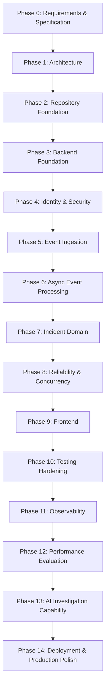

# ForgeOps — Delivery Phases & Milestones

Status: Implementation in progress — Phase 5 (Event Ingestion, FR-EV-1..4) complete/CI-verified; Phase 6 (Async Event Processing) complete/CI-verified (Slices 1–4: transactional outbox, publisher→RabbitMQ, idempotent consumer, retention cleanup); Phase 7 (Incident Domain) in progress — Slices 1–3 CI-verified (incident persistence foundation; manual lifecycle management + optimistic concurrency + audit; assignment history + comments); Slice 4 (event-driven detection/correlation) gated on open correlation decisions
Related: [PRD.md](./PRD.md) · [ARCHITECTURE.md](./ARCHITECTURE.md) · [DECISIONS.md](./DECISIONS.md) · [ENGINEERING_CONSTITUTION.md](./ENGINEERING_CONSTITUTION.md)

> This is a **high-level roadmap of phases and milestones only** — not a detailed task
> backlog. Detailed implementation tasks are defined at the start of each phase, against
> the requirements in [PRD.md](./PRD.md) and the rules in the
> [Engineering Constitution](./ENGINEERING_CONSTITUTION.md).
>
> The phase order is the preferred sequence. It changes only with a documented reason
> (and, where architecturally significant, an ADR in [DECISIONS.md](./DECISIONS.md)).

---

## Phase status legend

`Done` · `In progress` · `Not started`

---

## Roadmap overview

---

## Phases and milestones

### Phase 0 — Requirements & Specification — `Done`
Establish the documentation foundation.
- **Milestone:** The core foundation documents (constitution, PRD, architecture,
  decisions, tasks, README) exist, are internally consistent, and contain no application
  code. *(This phase.)*

### Phase 1 — Architecture — `Done`
Define the intended high-level architecture, the conceptual domain model, the system
invariants, and the initial decisions — so that persistence schemas, API contracts, and
application code can be built later without conceptual redesign.
- **Milestone:** [ARCHITECTURE.md](./ARCHITECTURE.md) (hardened architecture + conceptual
  domain model, incident state machine, transaction boundaries, idempotency model, outbox
  lifecycle, concurrency and failure semantics), [DOMAIN_MODEL.md](./DOMAIN_MODEL.md)
  (authoritative conceptual domain model: entities, aggregates, ownership, event↔incident
  relationship, correlation, assignment, audit and notification models),
  [ENGINEERING_INVARIANTS.md](./ENGINEERING_INVARIANTS.md) (stable invariants), and the
  ADRs in [DECISIONS.md](./DECISIONS.md) are in place. Domain and invariant design is
  complete.

### Phase 1b — Persistence Design — `Done`
Translate the approved domain model into a durable relational design while preserving the
invariants (no schema/migrations yet).
- **Milestone:** [PERSISTENCE_MODEL.md](./PERSISTENCE_MODEL.md) is in place (persistence
  structures, identifier and idempotency strategy, event→incident 0..1 representation,
  incident/state/assignment/comment/audit models, outbox model with concurrency and
  retention, index and constraint design, transaction boundaries, mutability policy, and
  the invariant-enforcement matrix), with persistence ADRs recorded in
  [DECISIONS.md](./DECISIONS.md).

### Phase 1c — API Contract Design — `Done`
Derive the external API interaction contract from the domain and persistence models (no
endpoints/DTOs/OpenAPI YAML yet).
- **Milestone:** [API_CONTRACTS.md](./API_CONTRACTS.md) is in place (resource inventory,
  URL versioning, authentication and authorization matrix, event ingestion with idempotency
  HTTP semantics, incident command endpoints and state-transition contract, ETag/If-Match
  concurrency, assignment/comments/audit/analytics APIs, non-authoritative SSE, advisory AI,
  RFC 9457 error model, validation, pagination, correlation ID, rate limiting, and
  API→domain→invariant traceability), with API ADRs recorded in
  [DECISIONS.md](./DECISIONS.md). **Repository/backend foundation (Phase 2) is the next
  gate** before any application code.

### Phase 2 — Repository Foundation — `In progress`
Establish project structure and tooling scaffolding (still no application logic).
- **Milestone:** Build tooling and repository conventions are ready for backend code.
- **Done so far:** `backend/` Spring Boot (Java 21) modular monolith via the Maven
  Wrapper; module packages (identity, events, incidents, audit, notifications, analytics,
  ai) with a minimal `common`; Actuator health endpoint; configuration foundation with no
  secrets; ArchUnit module-boundary tests plus context/health tests. `./mvnw clean verify`
  succeeds; `GET /actuator/health` returns `UP`.
- **Not done (deferred by scope):** no business logic, no database schema/migrations, no
  RabbitMQ/Redis, no frontend, no Docker/CI. This phase is not marked `Done` until the
  milestone is formally reviewed.

### Phase 3 — Backend Foundation — `In progress`
Establish the internal backend engineering architecture required before Identity, Events,
or Incident behavior.
- **Milestone:** Explicit, enforced internal architecture and cross-cutting foundations in
  place; build/tests/health still green.
- **Done so far:** module-internal layered architecture (api/application/domain/
  infrastructure) recorded in [ADR-0030](./DECISIONS.md#adr-0030--module-internal-layered-architecture-apiapplicationdomaininfrastructure)
  and documented in [backend/BACKEND_ARCHITECTURE.md](./backend/BACKEND_ARCHITECTURE.md);
  ArchUnit layer/boundary rules; `common` foundations only — correlation/request id,
  RFC 9457 Problem Details error handling, injectable `Clock`, and a UUID v7 `IdGenerator`
  (ADR-0023); logging, validation, transaction-boundary, and testing conventions
  documented. `./mvnw clean verify` passes 12/12; `/actuator/health` returns `UP` and
  echoes `X-Request-Id`.
- **Not done (deferred by scope):** no business logic, database, messaging, Redis,
  frontend, or AI. Not marked `Done` until the milestone is formally reviewed.

### Phase 4 — Identity & Security — `In progress` (design gate complete; implementation not started)
Implement admin-gated user provisioning, login, secure password storage, JWT auth, and
role-based access.
- **Design gate (Done):** [SECURITY_DESIGN.md](./SECURITY_DESIGN.md) defines the
  implementation-ready security architecture — Argon2id password hashing
  ([ADR-0031](./DECISIONS.md#adr-0031--argon2id-for-password-hashing)), RS256 short-lived
  access-only JWTs ([ADR-0032](./DECISIONS.md#adr-0032--rs256-short-lived-access-only-jwts-no-refresh-tokens-in-v1)),
  administrator-created accounts ([ADR-0033](./DECISIONS.md#adr-0033--administrator-created-accounts-no-open-self-registration)),
  authorization matrix, filter-chain order, 401/403 semantics, threat model, and test
  strategy. API_CONTRACTS.md reconciled (registration admin-gated; access-only tokens).
- **Phase 4.1 — Identity Persistence (In progress):** framework-free identity domain
  (User, Role, AccountStatus, PasswordHash port), JPA adapter, and Flyway migration for
  `users` + `user_roles` on PostgreSQL. Login identifier is a single unique `username`.
  ADRs [0034](./DECISIONS.md#adr-0034--flyway-for-database-migrations) (Flyway) and
  [0035](./DECISIONS.md#adr-0035--separate-jpa-entities-from-the-domain-model) (separate
  JPA entities) recorded. Bootstrap-admin credential creation **deferred to Phase 4.2**
  (needs hashing). Domain unit + architecture tests pass (15/15).
  **Verification status: GREEN — complete.** Authoritative GitHub Actions CI (Linux
  runner) executed the full Maven lifecycle including the PostgreSQL/Testcontainers
  integration tests, which passed. (The local Docker Desktop Engine 29 limitation below is
  retained as an environment note; it does not affect CI.)
- **Phase 4.2 — Slice 1: Argon2id password hashing (Done):** framework-free
  `PasswordHasher` domain port + `Argon2PasswordHasher` infrastructure adapter (Spring
  Security Crypto `Argon2PasswordEncoder` + Bouncy Castle) behind the existing
  `PasswordHash` boundary, with the SECURITY_DESIGN §5 baseline parameters (ADR-0031).
  6 focused unit tests; verified locally.
- **Phase 7 — Slice 3: incident assignment history + comments (Done):** assignment
  (assign/reassign/unassign) and investigation comments over the incident aggregate (FR-IN-4/5;
  DOMAIN_MODEL §11/§12; API_CONTRACTS §12/§13; ADR-0021; INV-INC-003/005/008). Domain:
  `Incident.assignTo`/`unassign` (version-bumping mutation of `current_assignee_id`, rejected once
  CLOSED); `IncidentAssignment` + `IncidentAssignmentRepository` (append + close-active + list);
  `IncidentComment` + `CommentCategory` (NOTE/INVESTIGATION/RESOLUTION) + `IncidentCommentRepository`
  (append + list); `UserExistenceReader`; `IncidentRepository.updateAssigneeWithVersionCheck`
  (assignment compare-and-set). New Flyway `V6__incident_assignments_comments.sql`:
  `incident_assignments` (FKs to incidents/users, `assigned_by`, `unassigned_at`, optional `team`;
  current pointer stays on `incidents.current_assignee_id`, ADR-0021) and `incident_comments`
  (category CHECK), each with an `(incident_id, time)` index for its list endpoint; V1–V5 unchanged.
  Application `IncidentService`: `assign`/`unassign` run one atomic transaction — optimistic
  version bump (INV-INC-005) + close the prior active assignment + append a new history record +
  audit (INV-INC-003/007) — with the **ENGINEER self-assign-only** rule enforced server-side
  (content-dependent, INV-SEC-005 → 403) and an unknown assignee → 422; `addComment` appends a
  comment + audit without mutating the incident (no version bump, no If-Match — API_CONTRACTS §11),
  `listComments` reads. API `IncidentController`: `POST`/`DELETE /api/v1/incidents/{id}/assignment`
  (If-Match required — 428/412) and `POST`/`GET /api/v1/incidents/{id}/comments`; RFC 9457 problem
  responses; `ForbiddenAssignmentException` → 403. RBAC in `SecurityConfig`: assignment POST =
  ADMIN/ENGINEER/INCIDENT_MANAGER (self rule in service), assignment DELETE = ADMIN/INCIDENT_MANAGER
  only, comment POST = ADMIN/ENGINEER/INCIDENT_MANAGER, comment GET = any authenticated reader.
  Audit action names (docs give examples only): `INCIDENT_ASSIGNED`/`INCIDENT_UNASSIGNED`/
  `INCIDENT_COMMENTED`. **Scope:** assignment + comments only — no detection/correlation (Slice 4,
  gated), no Phase 6 changes; comments are append-only and unversioned. Non-container suite
  **195/195** locally incl. architecture + module-boundary tests (5 domain assignment + 10
  application). Testcontainers PostgreSQL `IncidentAssignmentCommentPersistenceIntegrationTests`
  (assign+history+audit, reassign append-only + close-prior, unassign, unknown assignee, ENGINEER
  self-restriction, stale-version rejection, deterministic concurrent one-winner, comments
  append-only + audit + no version bump, DB category CHECK — with **real provisioned users** for
  FK integrity) and real-HTTP `IncidentAssignmentCommentApiIntegrationTests` (manager assign;
  ENGINEER self vs other → 403; VIEWER → 403; If-Match 428/412; ENGINEER-cannot-unassign → 403;
  manager unassign; comment ENG create / VIEWER 403 / read-all; comment does not change the ETag)
  are **blocked locally by the Docker Engine 29 limitation**; executed on CI. **Status: GREEN —
  verified by GitHub Actions CI (run 33659865245, commit 9c85a43): `./mvnw -B clean verify`
  succeeded on ubuntu-latest with native Docker, full unit + architecture + module-boundary +
  Testcontainers PostgreSQL & RabbitMQ suite with no exclusions.**
- **Phase 7 — Slice 2: manual incident management + lifecycle + optimistic concurrency + audit (Done):**
  manual incident management over the Slice 1 aggregate (FR-IN-1..4/6/7; DOMAIN_MODEL §10/§14;
  API_CONTRACTS §5/§9/§10/§11/§26; INV-INC-002..008; ADR-0018/0027/0028). Domain: lifecycle
  commands on the `Incident` aggregate (acknowledge/investigate/mitigate/resolve/close +
  changeSeverity), each returning a new aggregate at `version + 1` with the documented timestamp
  side effects (`resolved_at` on RESOLVED, `closed_at` on CLOSED; reopen — RESOLVED/MITIGATED →
  INVESTIGATING — **preserves** existing timestamps, a reported decision since the docs are silent);
  invalid transitions raise `IllegalIncidentTransitionException` (→ 409). New **audit module**
  (`com.forgeops.audit`): framework-free `AuditEntry` + `AuditActorType` (USER/SYSTEM) +
  append-only `AuditEntryRepository`; JPA entity/adapter; `V5__audit.sql` (`audit_entries` with a
  nullable `actor_id` FK → users, a polymorphic soft `resource_id` (no FK, §17), `actor_type`
  CHECK, JSONB `old_value`/`new_value`, and the §16 indexes). Application `IncidentService` owns
  the transaction: an atomic incident-mutation + audit-insert (INV-INC-007) guarded by an
  optimistic compare-and-set (`UPDATE ... WHERE id = ? AND version = ?`, INV-INC-005) that
  distinguishes NOT_FOUND (404), stale version (412), and invalid transition (409); the audit
  actor is the JWT principal (INV-SEC-005). API `IncidentController` (`/api/v1/incidents`): POST
  create (201 + strong ETag), GET `/{id}` (200 + ETag, 404), and the six command endpoints
  (If-Match required — missing → 428, stale → 412); `version` is surfaced only as the ETag
  (ADR-0028); RFC 9457 problem responses with correlation id. RBAC wired in `SecurityConfig`
  (read = all four roles; create + acknowledge/investigate/mitigate/resolve/severity =
  ADMIN/ENGINEER/INCIDENT_MANAGER; **close = ADMIN/INCIDENT_MANAGER only**; VIEWER cannot mutate).
  **Scope:** manual management only — no detection/correlation (Slice 4, gated), no assignment/
  comments (Slice 3), no Phase 6 semantic changes. Non-container suite **180/180** locally incl.
  architecture + module-boundary tests (18 domain lifecycle + 8 application service). Testcontainers
  PostgreSQL `IncidentLifecyclePersistenceIntegrationTests` (create+audit, version-increments-once,
  stale-412-writes-no-audit, resolve/close timestamps, append-only, deterministic concurrent
  one-winner, DB CHECK) and real-HTTP `IncidentApiIntegrationTests` (401; create/close RBAC incl.
  VIEWER 403 and ENGINEER-cannot-close; ETag; 404; 409 invalid transition; If-Match 428/412/
  success) are **blocked locally by the Docker Engine 29 limitation**; executed on CI. **One
  CI-only test-fixture issue was found and fixed (test-only, no production change):** the
  persistence IT used a hardcoded audit actor id that was never persisted, violating the
  `audit_entries.actor_id → users(id)` FK (7 errors); the IT now provisions that user in
  `@BeforeEach`. A temporary failure-only CI diagnostic step was added to surface the surefire
  error and then removed. **Status: GREEN — verified by GitHub Actions CI (run 33655558580,
  commit d44d784): `./mvnw -B clean verify` succeeded on ubuntu-latest with native Docker, full
  unit + architecture + module-boundary + Testcontainers PostgreSQL & RabbitMQ suite with no
  exclusions.**
- **Phase 7 — Slice 1: incident persistence + aggregate foundation (Done):** establishes the
  persisted `Incident` aggregate and its DB foundation (DOMAIN_MODEL §2/§10, PERSISTENCE_MODEL
  §8/§9/§16/§19, INV-INC-001/004/005). New `incidents.domain`: framework-free `Incident`
  aggregate (id, title, service_id, environment_id, failure_signature, severity, state,
  current_assignee_id, version, created_at, resolved_at, closed_at) with an `open(...)` factory
  (state=OPEN, version=0) + full rehydration constructor enforcing the foundation invariants
  (required id/service/environment/severity/state, non-negative version, immutable identity, no
  hard delete); `IncidentState` (OPEN/ACKNOWLEDGED/INVESTIGATING/MITIGATED/RESOLVED/CLOSED — no
  CANCELLED) and `IncidentSeverity` (INFO/WARNING/MINOR/MAJOR/CRITICAL) enums; `IncidentRepository`
  port (`save`/`findById` only — no speculative methods). New Flyway `V4__incidents.sql`: the
  `incidents` table with FKs to `services`/`environments`/`users` (nullable assignee),
  `ck_incidents_severity`/`ck_incidents_state` CHECKs, `ck_incidents_version_non_negative`, and
  the §16 indexes (`state`; `(service_id, environment_id, created_at)`; `(severity, state)`;
  `(current_assignee_id)` partial where assigned); plus the FK
  `operational_events.incident_id → incidents(id)` intentionally deferred from V2 (added via
  `ALTER TABLE`, no `ON DELETE` cascade — incidents are never hard-deleted, §19). V1/V2/V3
  unchanged. New `incidents.infrastructure`: `IncidentEntity` (`version` mapped as a plain column,
  **not** JPA `@Version` — command-side optimistic locking/ETag/If-Match is Slice 2),
  package-private Spring Data repo, and `JpaIncidentRepository` adapter (framework-free domain
  boundary preserved). **Scope: persistence + aggregate foundation ONLY** — no lifecycle commands,
  no REST API, no detection/correlation, no assignment/comments/audit tables, no ETag/If-Match, no
  Phase 6 semantic changes. Non-container suite **154/154** locally incl. architecture +
  module-boundary tests (9 new `IncidentTests`; incidents.domain stays framework-free and does not
  depend on events). Testcontainers PostgreSQL `IncidentPersistenceIntegrationTests` (V4 applies on
  V1–V3; round-trip; nullable assignee/timestamps; service/environment/assignee FK enforcement;
  invalid state/severity/negative-version rejected by DB CHECKs; `operational_events.incident_id`
  FK accepts a real incident and rejects an unknown one; §16 indexes present; re-save by PK neither
  deletes nor duplicates) is **blocked locally by the Docker Engine 29 limitation**; executed on CI.
  **Status: GREEN — verified by GitHub Actions CI (run 33647596093, commit 77c5b8a): `./mvnw -B
  clean verify` succeeded on ubuntu-latest with native Docker, full unit + architecture +
  module-boundary + Testcontainers PostgreSQL & RabbitMQ suite with no exclusions.**
- **Phase 6 — Slice 4: outbox retention cleanup (Done):** the closing Phase 6 item — prune old
  `PUBLISHED` outbox rows so the append-heavy `outbox_messages` table stays bounded
  (PERSISTENCE_MODEL §15, ADR-0019, INV-OUTBOX-006). New framework-free
  `OutboxMessageRepository.deletePublishedOlderThan(cutoff, batchSize)`; the Spring Data adapter
  runs a bounded native `DELETE FROM outbox_messages WHERE id IN (SELECT id ... WHERE
  status='PUBLISHED' AND published_at < :cutoff ORDER BY published_at LIMIT :batchSize)` using
  the existing `(published_at) WHERE status='PUBLISHED'` partial index — **no migration**.
  `events.application` `OutboxCleanupService` computes `cutoff = now − retention` from the
  injected `Clock` and deletes in bounded batches (each in its own `TransactionTemplate`) until
  a short batch stops the loop; `OutboxCleanupProperties` (`forgeops.outbox.cleanup.*`) is
  validated with fallback defaults. `events.infrastructure.messaging` `OutboxCleanupScheduler`
  (`@Scheduled` fixed-delay, enable-gated, per-cycle exception isolation) mirrors the publisher
  scheduler; `SchedulingConfig` binds it. **ForgeOps v1 decision (PERSISTENCE_MODEL §15):**
  retention 7 days (`PT168H`), hourly cadence (`PT1H`), 500 rows/batch, enabled by default.
  **Safety:** only `status='PUBLISHED'` rows with `published_at` strictly before the cutoff are
  deleted; `PENDING` (incl. failed-retryable / `next_attempt_at`) and `NULL published_at` rows
  are never touched (INV-OUTBOX-003); cleanup never affects delivery — the publisher and
  recovery paths read only `PENDING` rows (ADR-0022) and the outbox is never authoritative
  business state (INV-OUTBOX-007); repeated runs are safe (idempotent). No Slice 1/2/3 semantic
  changes. Non-container suite **145/145** locally incl. architecture + module-boundary tests
  (11 new unit tests: `OutboxCleanupService` cutoff/eligibility/multi-batch/stop/failure;
  `OutboxCleanupProperties` defaults/validation). Testcontainers PostgreSQL
  `OutboxRetentionCleanupIntegrationTests` (eligibility matrix incl. boundary/recent/PENDING/
  retryable/NULL-published_at, >1200-row batching via the service, repeated no-op, rollback-
  does-not-corrupt, publisher/cleanup disjoint-rows) is **blocked locally by the Docker Engine
  29 limitation**; executed on CI. **One CI-only test-fixture issue was found and fixed
  (test-only, no production change):** the batching test positioned its retained "recent" row
  at a fixed instant while the service computes the cutoff from the system `Clock`, so on CI's
  real date that row was (correctly) also eligible (1201 vs 1200) — the service-driven tests now
  position fixtures relative to the injected `Clock`. **Status: GREEN — verified by GitHub
  Actions CI (run 33644108557, commit fb4660c): `./mvnw -B clean verify` succeeded on
  ubuntu-latest with native Docker, full unit + architecture + module-boundary + Testcontainers
  PostgreSQL & RabbitMQ suite with no exclusions.** This completes Phase 6.
- **Phase 6 — Slice 3: idempotent RabbitMQ consumer (Done):** the asynchronous consumer side
  of Phase 6 (ADR-0014, ADR-0005; FR-EV-5 consumer side, FR-RL-3/4/5/10/11; INV-MSG-001..006).
  New `events.domain` `ProcessingOutcome` (MARKED/ALREADY_PROCESSED/NOT_FOUND) +
  `OperationalEventRepository.markProcessed(UUID)` (framework-free); the Spring Data adapter
  implements it as a conditional native `UPDATE operational_events SET status='PROCESSED'
  WHERE id=? AND status='RECEIVED'` — the idempotency primitive (INV-MSG-003, FR-RL-3/10):
  a duplicate/concurrent delivery either transitions the row exactly once or observes it
  already PROCESSED; no check-then-update race. **No migration** — reuses the existing
  `status` RECEIVED/PROCESSED column (V2). `events.application` `EventProcessingService`
  wraps the mark in a `TransactionTemplate` (the commit precedes the ack) and raises
  `NonRetryableEventProcessingException` for NOT_FOUND (poison → dead-letter, not retry);
  `EventConsumerProperties` (`forgeops.events.consumer.*`: enabled, concurrency, bounded
  retry). `events.infrastructure.messaging` `OperationalEventConsumer` (`@RabbitListener` on
  the processing queue; parses `event_id` from the canonical JSON body; parse/missing/non-UUID
  → non-retryable) and `EventConsumerConfig` (`SimpleRabbitListenerContainerFactory` with
  `AcknowledgeMode.AUTO` so the ack follows the successful method return = after commit,
  `defaultRequeueRejected=false`, a stateless bounded-retry interceptor with exponential
  backoff that never retries the non-retryable poison exception, and a
  `RejectAndDontRequeueRecoverer` so exhausted/poison messages are rejected without requeue);
  `RabbitMqTopologyConfig` extended with a durable dead-letter exchange + queue and the
  processing queue's `x-dead-letter-exchange`/routing-key args (INV-MSG-006, FR-RL-5). The
  effect ends at `status = PROCESSED`; **no incidents / detection / correlation (Phase 7)**.
  Delivery is at-least-once with an exactly-once **effect** via idempotency; exactly-once
  delivery is **not** claimed (INV-MSG-001/-002). The consumer is disabled in tests by default
  (`forgeops.events.consumer.enabled=false`) so integration tests enable it explicitly.
  Non-container suite passes **134/134** locally incl. architecture + module-boundary tests
  (8 new unit tests: `EventProcessingService` mark/duplicate-no-op/poison/transient;
  `EventConsumerProperties` defaults). Testcontainers integration tests (PostgreSQL + RabbitMQ:
  `EventProcessingRepositoryIntegrationTests` conditional-update outcomes in an explicit
  transaction; `OperationalEventConsumerIntegrationTests` happy path / duplicate-exactly-once /
  poison→DLQ; `ConsumerRetryDeadLetterIntegrationTests` transient-failure retried then→DLQ;
  `EndToEndEventProcessingIntegrationTests` REST→outbox→publisher→RabbitMQ→consumer→PROCESSED)
  are **blocked locally by the Docker Engine 29 limitation**; executed on CI. Slice 1/2
  semantics unchanged (outbox persistence, publisher, confirms, SKIP LOCKED, PENDING→PUBLISHED,
  backoff). Secrets are env-only. **One CI-only test-fixture issue was found and fixed
  (test-only, no production change):** the two new raw-JDBC insert helpers bound
  `java.time.Instant` directly for the TIMESTAMPTZ columns, which the PostgreSQL driver cannot
  type-infer (surfaced as `BadSqlGrammarException`) — now wrapped in `java.sql.Timestamp.from(...)`.
  **Status: GREEN — verified by GitHub Actions CI (run 33639030614, commit 484ae95):
  `./mvnw -B clean verify` succeeded on ubuntu-latest with native Docker, running the full
  unit + architecture + module-boundary + Testcontainers PostgreSQL & RabbitMQ suite with no
  exclusions.**
- **Phase 6 — Slice 2: outbox publisher + RabbitMQ handoff (In progress):** reliably moves
  committed PENDING outbox rows from PostgreSQL to RabbitMQ (ADR-0013 steps 4–7, ADR-0019,
  ADR-0022, ADR-0014; FR-EV-5, FR-RL-8/9; PERSISTENCE_MODEL §14/§16). Added
  `spring-boot-starter-amqp` (runtime) and `org.testcontainers:rabbitmq` (test), Boot-BOM
  managed. Extended the `OutboxMessageRepository` port with `claimPending`/`markPublished`/
  `recordFailure` (framework-free); the Spring Data adapter implements claiming via a native
  `... WHERE status='PENDING' AND (next_attempt_at IS NULL OR next_attempt_at <= :now) ORDER BY
  created_at LIMIT :batchSize FOR UPDATE SKIP LOCKED` (uses the §16 partial index) and
  conditional `UPDATE ... WHERE id=? AND status='PENDING'` for mark/failure (stale-worker
  safe). New `events.domain` `MessageBroker` port + `MessagePublishException`; `events.
  infrastructure.messaging` `RabbitMqTopologyConfig` (durable topic exchange `forgeops.events`,
  durable queue `forgeops.events.processing`, routing key `operational-event.received` — all
  config-driven, internal, not a REST contract), `RabbitMessageBroker` (publishes persistent
  JSON with `messageId`=outbox id + `aggregate_id`/`message_type` headers, blocks on
  **publisher confirms** so success = broker-accepted). `events.application`
  `OutboxPublishService` runs one `TransactionTemplate` cycle: claim due PENDING → publish each
  → `markPublished` on confirm / `recordFailure` (attempts+1, capped-exponential
  `next_attempt_at` via `BackoffPolicy` base 5s/cap 5m, bounded `last_error`) on failure; a
  single failure never aborts the batch. Config-driven `@Scheduled` fixed-delay poller
  (`OutboxPublisherScheduler`, `@EnableScheduling`, cycle-exception isolation; disabled in tests
  via `forgeops.outbox.publisher.enabled=false`). Only `PENDING → PUBLISHED`; no new status.
  Delivery is at-least-once (INV-MSG-001/-002, INV-OUTBOX-004/-005): a crash after broker
  acceptance but before commit re-publishes later — handled by future idempotent consumers.
  Non-container suite passes **126/126** locally incl. architecture + module-boundary tests
  (11 new unit tests: `BackoffPolicy` capped/overflow-safe; `OutboxPublishService`
  success/failure/retry-metadata/batch-isolation/claim-eligibility). Testcontainers integration
  tests (`OutboxPublisherIntegrationTests` — real PostgreSQL + real RabbitMQ: confirmed publish
  → PUBLISHED + message on queue with correct id/routing/persistence/content-type, claim
  eligibility, conditional PUBLISHED guard; `OutboxPublisherFailureIntegrationTests` — retryable
  failure metadata + SKIP LOCKED concurrency) are written but **blocked locally by the Docker
  Engine 29 limitation**; not executed locally. Public REST API unchanged; no outbox/publisher/
  broker data exposed. Secrets are env-only (no committed RabbitMQ credentials, no default
  password). **NOT in this slice:** consumers, consumer idempotency, explicit consumer ack,
  DLQ/dead-letter, incidents, Redis, SSE, frontend, AI, rate limiting, retention cleanup. No
  schema change (V3 already had the publisher fields). **Two CI-only test issues were found
  and fixed (test/config only, no production change):** (1) an integration test invoked the
  `@Modifying markPublished` repository method outside a transaction — now wrapped in a
  `TransactionTemplate` (production always runs it inside the publisher transaction); (2)
  adding `spring-boot-starter-amqp` registered a RabbitMQ health contributor that made the
  broker-less `HealthEndpointTests` report `503` — the rabbit health indicator is now disabled
  in the **test** profile only (production `/actuator/health` still includes RabbitMQ).
  **Status: GREEN — verified by GitHub Actions CI (run 33632630659, commit faec442):
  `./mvnw -B clean verify` succeeded on ubuntu-latest with native Docker, running the full
  unit + architecture + module-boundary + Testcontainers PostgreSQL & RabbitMQ suite with no
  exclusions.**
- **Phase 6 — Slice 1: transactional outbox persistence (In progress):** the durable outbox
  foundation — **persistence + atomic event+outbox commit only, no publishing**
  (ADR-0013 steps 1–3, ADR-0019, PERSISTENCE_MODEL §13/§16/§18, DOMAIN_MODEL §9,
  INV-OUTBOX-001, INV-EVENT-006). New Flyway `V3__outbox.sql` creates `outbox_messages`
  (`id` UUID v7, `message_type`, `aggregate_type`, `aggregate_id` UUID, `payload` JSONB,
  `status` PENDING/PUBLISHED CHECK, `attempts` ≥0 CHECK, `created_at`, and the unused-for-now
  publisher fields `published_at`/`next_attempt_at`/`last_error`), with the §16 partial
  indexes (`(status, next_attempt_at) WHERE status='PENDING'` and `(published_at) WHERE
  status='PUBLISHED'`). Per the approved reconnaissance, `aggregate_id` is a generic UUID with
  **no** FK to `operational_events(id)` (the model does not mandate one; `aggregate_type` is
  intentionally generic); event↔outbox pairing is guaranteed by the atomic transaction. New
  `events.domain` `OutboxMessage` (framework-free) + `OutboxStatus` + `OutboxMessageRepository`
  port; `events.infrastructure` `OutboxMessageEntity` (JSONB via `@JdbcTypeCode(SqlTypes.JSON)`),
  Spring Data repo, `JpaOutboxMessageRepository` (saveAndFlush). `events.application`
  `OutboxMessageFactory` builds a deterministic `PENDING` message (`aggregate_type`=
  `OPERATIONAL_EVENT`, `message_type`=`OPERATIONAL_EVENT_RECEIVED`, `aggregate_id`=event id,
  `created_at`=event `received_at`, payload = internal handoff body identifying the event; not
  a public API contract). `EventIngestionService` now writes the event **and** exactly one
  outbox message inside the **same** `TransactionTemplate` transaction — both commit or both
  roll back (never a durable event without its outbox record); the isolated transaction still
  protects the concurrent-duplicate recovery re-read. Replay and conflict paths create **no**
  outbox message; the public event API is unchanged (no outbox data exposed). All Phase 5
  semantics preserved (reference validation 422, 400/401/403/409, microsecond `received_at`,
  canonical hashing, JWT producer identity, UUID v7). Non-container suite passes **115/115**
  locally incl. architecture + module-boundary tests (7 new unit tests: `OutboxMessageFactory`
  determinism + `EventIngestionService` outbox interaction — one per new event, none on
  replay/conflict). Testcontainers integration tests (`EventIngestionIntegrationTests` extended
  with outbox assertions; new `OutboxAtomicRollbackIntegrationTests` forcing an outbox-write
  failure and asserting **neither** event nor outbox persists) are written but **blocked
  locally by the Docker Engine 29 limitation**; not executed locally. **NOT in this slice:**
  RabbitMQ, publisher/polling, `FOR UPDATE SKIP LOCKED` claiming, PUBLISHED transitions,
  retry/backoff, acknowledgement, dead-letter, consumers, async workers, incidents, Redis,
  SSE, frontend, AI. **Status: GREEN — verified by GitHub Actions CI (run 33608264723, commit
  cdeaa15): `./mvnw -B clean verify` succeeded on ubuntu-latest with native Docker, running the
  full unit + architecture + module-boundary + Testcontainers PostgreSQL suite (incl. the
  atomic event+outbox and rollback integration tests) with no exclusions.**
- **Phase 5 — Slice 1: event ingestion core (Done — CI verified):** the synchronous
  authenticated-submit → validate → idempotency → persist path for operational events
  (FR-EV-1..4, API_CONTRACTS §6/§7, PERSISTENCE_MODEL §5/§6/§16/§17, ADR-0016/0023/0024/0025).
  New `events` module (`domain`/`application`/`infrastructure`/`api`) mirroring the identity
  layering (ADR-0030/0035). `POST /api/v1/events`: authenticated ADMIN/ENGINEER/INCIDENT_MANAGER
  (VIEWER → `403`), `202 Accepted` with the accepted-event representation (`id`, attributes,
  `received_at`, `status: RECEIVED`, nullable `incident_id`, `payload` — no `payload_hash`,
  no outbox reference per §26). Producer identity (`client_id`) is taken from the JWT
  principal (`AuthenticatedUser.userId()`), never from the request (SECURITY_DESIGN §9,
  INV-SEC-005). Server-generated UUID v7 id via the existing `IdGenerator`. Durable
  persistence in PostgreSQL (`operational_events`, Flyway `V2__events.sql`); JSONB payload via
  `@JdbcTypeCode(SqlTypes.JSON)` (no new runtime dependency). Idempotency scoped to
  `(client_id, idempotency_key)` with the DB unique constraint authoritative: Case A new →
  `202`; Case B same key + same canonicalized payload (`payload_hash`, SHA-256 over
  Jackson-canonicalized JSON with sorted keys, ADR-0025) → `202` replay of the same event;
  Case C same key + different payload → `409` (RFC 9457). Acceptance is `@Transactional`
  (compatible with the Phase-6 event+outbox atomic commit); a concurrent-duplicate race that
  slips past the pre-check is caught at the unique constraint and re-resolved to replay/conflict,
  so two concurrent identical requests yield exactly one event. Non-container suite passes
  **104/104** locally, incl. architecture + module-boundary tests (24 new: canonicalizer/hash
  determinism, ingestion first/replay/conflict/producer-scoped/server-id/race, and the
  MockMvc security+validation boundary incl. VIEWER 403, unauthenticated 401, 400 validation,
  409 conflict, and client-cannot-override-producer-identity). Testcontainers integration test
  (`EventIngestionIntegrationTests`: persist+retrieve, unique constraint, replay `202`,
  conflict `409`, producer-scoped keys, VIEWER `403`, unauthenticated `401`, no-key distinct
  events, concurrent-duplicate → exactly one event) is written but **blocked locally by the
  Docker Engine 29 limitation**; Testcontainers did not execute locally. **Reference data:**
  `service`/`environment` are real reference data owned by the events module (DOMAIN_MODEL
  §1.1, PERSISTENCE_MODEL §4/§5): `operational_events.service_id`/`environment_id` are FKs to
  `services`/`environments`; the submitted keys are resolved to ids during ingestion and an
  unknown key is rejected with `422` (`UnknownReferenceException`, RFC 9457) before any
  persistence (INV-SEC-003). The controlled set is provisioned by the Flyway migration
  (ADR-0034) — the approved reference-data provisioning mechanism; **service/environment
  management (CRUD) APIs remain deferred** to a later ADMIN slice (API_CONTRACTS §5), a
  separate capability from the tables/FK/seed. **NOT in this slice:** transactional outbox,
  RabbitMQ, async consumers, incident detection/correlation, Redis, SSE, AI, frontend, rate
  limiting, service/environment CRUD. **Two real-DB defects were found and fixed during the
  CI verification gate:** (1) `received_at` was truncated to microseconds so the acceptance
  response is byte-identical to the value PostgreSQL stores and returns on an idempotent
  replay (a nanosecond JVM instant was otherwise rounded on storage); (2) the insert now runs
  in its own transaction (`TransactionTemplate`) so a unique-constraint violation on a
  concurrent duplicate rolls back in isolation and the recovery re-read runs in a fresh
  transaction — a same-transaction re-read would have failed with "current transaction is
  aborted". **Status: GREEN — verified by GitHub Actions CI (run 33604660966, commit
  ccc5035): `./mvnw -B clean verify` succeeded on ubuntu-latest with native Docker, running
  the full unit + architecture + module-boundary + Testcontainers PostgreSQL suite with no
  exclusions.**
- **Phase 4.2 — Slice 5: role-based authorization + 401/403 boundary (In progress):**
  the authorization foundation on top of Slice 4 authentication — **authorization only**
  (SECURITY_DESIGN §14/§15, API_CONTRACTS §4). Roles are mapped to Spring authorities in
  `AuthenticatedUserAuthentication` as `ROLE_<name>` (single canonical prefix, added exactly
  once, so `hasRole("ADMIN")` matches with no `ROLE_ROLE_` duplication); the roles come
  solely from the Slice-4 validated-token-derived principal — never from request headers,
  body, or query. Authorization is expressed as URL-level request-matcher rules on the
  existing single stateless `SecurityConfig` chain (no method-level annotations, no second
  chain): `POST /api/v1/auth/login` and `/actuator/health` public, `POST /api/v1/auth/register`
  **requires ADMIN**, and everything else (incl. `GET /api/v1/auth/me`) requires
  authentication. Implemented the contract-defined ADMIN-gated `POST /api/v1/auth/register`
  (ADR-0033) backed by the existing Slice-2 `UserProvisioningService` — `RegisterRequest`
  (username/password/roles) / `RegisterResponse` (id/username/roles/status, **no secret**),
  `201` on success, `409` on duplicate username, `400` on invalid role/validation. Added
  `ProblemDetailAccessDeniedHandler` producing RFC 9457 `403` `application/problem+json` with
  the correlation id, kept distinct from the `401`
  `ProblemDetailAuthenticationEntryPoint`; both preserve the correlation id and leak no
  token/secret/config/stack-trace. Slice-4 authentication (RS256 validation, disabled-user
  rejection, PostgreSQL-authoritative account status) is unchanged. No new roles, no
  permission tables, no policy engine, no new dependencies. Non-container suite passes
  **80/80** locally, incl. architecture + module-boundary tests (16 new: authority mapping
  per role + multi-role + no-double-prefix; MockMvc authorization over the real filter chain
  — 401 vs 403, ADMIN-only register, invalid-token→401-not-403, client cannot elevate via
  header/body/query). Testcontainers authorization integration test
  (`AuthorizationIntegrationTests`: login public; `/me` any-authenticated 200; ADMIN
  register 201 with no secret echoed; ENGINEER/VIEWER register→403 problem+json; missing
  token→401; invalid/expired→401; role-claim tampering→401 not elevation; deactivated→401)
  is written but **blocked locally by the Docker Engine 29 limitation** (`/info` returns
  HTTP 400 to docker-java); Testcontainers did not execute locally. No new business/domain
  endpoints (events/incidents/analytics/SSE/AI), no refresh tokens, no OAuth/OIDC, no
  password reset, no MFA, no Redis.
  **CI run #1 (Slice 5): FAILED — 117 tests, 4 errors, 0 failures.** Authoritative cause
  (from the CI surefire output): the four erroring tests were exactly the negative
  **POST `/api/v1/auth/register`** cases (expired / invalid / missing / tampered token),
  each throwing `ResourceAccessException: ... cannot retry due to server authentication, in
  streaming mode` at the HTTP client — never a production defect. The JDK `HttpURLConnection`
  used by `TestRestTemplate` streamed the POST body, and when the server correctly returned
  `401` it treated the response as an auth challenge and tried to resend the request, which
  it cannot do once the body has been written — independent of any `WWW-Authenticate` header
  (the server sends none; httpBasic is disabled). (The 403 cases and the body-less `GET /me`
  negative cases were unaffected, which is why only these four POST-401 tests failed.)
  **CI run #2 (BufferingClientHttpRequestFactory) also FAILED — same 4 errors:** buffering at
  the Spring layer does not help because the JDK connection still streams to
  `getOutputStream()` and refuses to replay on 401. **Definitive fix (test-only):** added a
  **test-scoped** `org.apache.httpcomponents.client5:httpclient5` dependency (Boot-BOM
  managed) and switched `AuthorizationIntegrationTests` to drive requests via
  `HttpComponentsClientHttpRequestFactory` (HttpClient 5), which sends a repeatable entity and
  returns the `401` as an ordinary response so the negative POSTs assert their `401`/`403`.
  Test-only: production makes no outbound HTTP calls; the server's `SecurityConfig`, entry
  point, access-denied handler, JWT validation and authorization rules are unchanged, and all
  401/403 assertions + request bodies are preserved. Non-container suite remains **80/80**
  green; `clean verify` builds the jar. Integration tests still cannot run locally (Docker
  Engine 29 block). **Status: YELLOW — definitive fix implemented, CI re-verification
  pending.**
- **Phase 4.2 — Slice 4: JWT validation + authenticated principal (In progress):**
  the authentication foundation for accepting a previously issued RS256 access token on
  protected requests — **authentication only, no authorization** (SECURITY_DESIGN §7/§11/§12).
  Added the minimal `spring-boot-starter-security` for a stateless Bearer-JWT filter chain.
  Application layer: `AccessTokenValidator` port + `ValidatedAccessToken` value +
  `InvalidAccessTokenException`; `AuthenticatedUser` principal (framework-free, no
  Nimbus/Spring Security types); `AuthenticationService` resolves the token `sub` against
  `UserRepository` and rejects unknown or non-`ACTIVE` users (PostgreSQL authoritative for
  account status per §12), taking roles from the token claim (not re-queried). Infrastructure
  `security`: `NimbusRs256AccessTokenValidator` (verifies with the configured RSA **public**
  key, algorithm constrained explicitly to RS256 so `alg=none`/HS256/substitution are
  rejected before verification; validates `iss`/`aud`/`exp`/`iat`(+60s skew) and requires
  `sub`/`roles`/`jti`); `JwtAuthenticationFilter` (`OncePerRequest`, extracts only
  `Authorization: Bearer`, never logs the token/header); `AuthenticatedUserAuthentication`
  adapter; `ProblemDetailAuthenticationEntryPoint` (RFC 9457 `401` + correlation id);
  `SecurityConfig` (stateless, CSRF/CORS/form-login/HTTP-Basic disabled, `POST
  /api/v1/auth/login` and `/actuator/health` public, everything else authenticated,
  `JwtAuthenticationFilter` before `UsernamePasswordAuthenticationFilter`). Api: protected
  `GET /api/v1/auth/me` (API_CONTRACTS §4) returns the authenticated principal's id + roles.
  The correlation-id filter remains at highest precedence, so `401`s keep their correlation
  id. Reused the Slice-3 `JwtProperties`/`RsaKeyPair`; no second key system, no OAuth2/OIDC,
  no sessions, no refresh tokens, no Redis. Non-container suite passes **64/64** locally,
  including architecture + module-boundary tests (27 new: validator + algorithm-confusion/
  tampering/expiry/claim attacks, `AuthenticationService` resolution incl. disabled/unknown,
  and filter Bearer-extraction incl. client cannot override identity). Testcontainers
  integration test (`JwtAuthenticationIntegrationTests`: login→token→`/me` 200; missing/
  malformed/bad-signature/expired/wrong-issuer/wrong-audience→401; deactivated + unknown
  user→401; login stays public) is written but **blocked locally by the Docker Engine 29
  limitation** (`/info` returns HTTP 400 to docker-java); Testcontainers did not execute
  locally. **Authoritative verification pending CI — YELLOW.** No role-based authorization,
  no ADMIN/ENGINEER/INCIDENT_MANAGER/VIEWER enforcement, no `403` model, no refresh tokens.
- **Phase 4.2 — Slice 3: login + RS256 JWT access-token issuance (In progress):**
  application `LoginService` (loads user, rejects unknown/disabled/wrong-password
  identically via `PasswordHasher.verify` with dummy-hash timing parity, no enumeration)
  + `AccessTokenIssuer` port; infrastructure `NimbusRs256AccessTokenIssuer` (RS256, claims
  `sub`/`roles`/`iss`/`aud`/`iat`/`exp`/`jti` derived server-side via `Clock` +
  `IdGenerator`); `JwtProperties`/`JwtKeyConfiguration` (RSA keys from env, never
  committed); public `POST /api/v1/auth/login` (`200 {access_token,token_type,expires_in}`
  / generic `401` RFC 9457) per API_CONTRACTS §4 and ADR-0032. Added `nimbus-jose-jwt`
  (pinned). Test-only RSA keys in `src/test/resources`. Non-container suite passes 37/37
  locally (9 new unit tests: login + JWT issuer). Login Testcontainers integration tests
  written; blocked locally by Docker Engine 29; **authoritative verification pending CI.**
  No JWT validation filter, principal extraction, authorization, 401/403 chain, or refresh
  tokens.
  **CI fix (test isolation):** the first CI run failed with
  `UserProvisioningIntegrationTests.provisionsAndRetrievesUser » UsernameAlreadyExists
  'alice'` — a shared-database isolation defect, not a production bug. The `@SpringBootTest`
  integration classes share one PostgreSQL container and do not roll back, so `alice`
  created by `LoginIntegrationTests` leaked into `UserProvisioningIntegrationTests` under a
  different CI execution order. Fixed by truncating the identity tables before each test in
  the three `@SpringBootTest` integration classes (test-only; production uniqueness /
  constraint / provisioning semantics unchanged). Re-verification **pending CI**.
- **Phase 4.2 — Slice 2: admin provisioning + bootstrap admin (In progress):**
  application-layer `UserProvisioningService` (server-generated UUID v7 id, Argon2id hash,
  role assignment, ACTIVE status, `@Transactional`, DB-authoritative username uniqueness)
  and an idempotent env-configured bootstrap admin (`BootstrapAdminProperties` +
  `BootstrapAdminInitializer` under `forgeops.security.bootstrap-admin.*`; creates the
  admin only when absent, never overwrites, never logs the secret). No self-registration
  endpoint, no JWT/auth/authorization. Non-container suite passes 28/28 locally (7 new
  provisioning unit tests). Provisioning + bootstrap Testcontainers integration tests are
  written but blocked locally by the Docker Engine 29 limitation; **authoritative
  verification pending CI.**
  **Historical note (4.1 root cause, retained):
  Root cause (investigated,
  evidence-backed):** Docker Engine 29 raised its minimum Docker API version; the
  docker-java client bundled with Testcontainers defaults to an older API version below
  that minimum, so the daemon rejects the `/info` call with HTTP 400 (empty body). The
  Docker CLI works because its Go client negotiates differently. Confirmed with
  Testcontainers 1.19.8 and 1.20.4 (docker-java 3.3.6/3.4.0), and a client-side
  `DOCKER_API_VERSION=1.44` pin (via shell and via surefire) did not resolve it. Public
  reports show even newer Testcontainers (1.20.6 / 1.21.3 / 2.0.x) do not fix this
  out-of-the-box, so a version bump is not a proven fix (no override is kept).
  **Unblock:** correct the environment — lower the Docker Desktop engine
  `min-api-version` (e.g. to `1.24`) for local runs, and/or verify on a Linux/CI Docker
  environment. DB-behavior verification (migration apply, constraints) remains **unproven**
  until the tests run on a compatible Docker engine.
- **Integration-test environment (implementation note):** local development on Docker
  Desktop with Docker Engine 29.x cannot run the Testcontainers integration tests
  (docker-java `/info` 400). The **authoritative integration verification runs in CI on a
  Linux Docker runner**, where Testcontainers works natively with no Docker workarounds. A
  minimal workflow exists at `.github/workflows/backend-ci.yml` (Ubuntu, JDK 21, Maven
  wrapper, `./mvnw -B clean verify`, no exclusions). **Pending execution:** this workspace
  is not yet a git repository with a remote, so CI has not run; Phase 4.1 stays **YELLOW**
  until the workflow executes and all tests (Testcontainers + context + health +
  architecture + unit) pass on CI.
- **Milestone (implementation):** Authenticated, authorized access works end to end
  (FR-ID-*). Authentication, JWT, authorization, and HTTP endpoints remain **not started**.

### Phase 5 — Event Ingestion — `Done`
Implement the event ingestion API with validation, persistence, and idempotency.
- **Milestone:** Authenticated clients can submit and durably persist validated,
  de-duplicated events (FR-EV-1..4). **Met.** Delivered by Phase 5 Slice 1 (event ingestion
  core; see the detailed entry above). FR-EV-1..4 are all implemented: authenticated
  submission (ADMIN/ENGINEER/INCIDENT_MANAGER; VIEWER 403), validation before acceptance
  (400 syntactic, 422 unknown service/environment reference), durable PostgreSQL persistence
  with server-generated UUID v7 ids, and producer-scoped idempotency (canonical `payload_hash`;
  same-key/same-payload replay → 202, same-key/different-payload conflict → 409; DB
  `(client_id, idempotency_key)` uniqueness authoritative incl. concurrent-duplicate safety).
  **Verified by GitHub Actions CI: run 33604660966, commit `ccc5035`, `./mvnw -B clean verify`
  SUCCESS on native Linux Docker/Testcontainers PostgreSQL, no exclusions.** FR-EV-5
  (asynchronous processing) is **not** part of this milestone — it belongs to Phase 6.

### Phase 6 — Async Event Processing — `Done`
Implement the **transactional outbox** (event + outbox record committed in one
transaction), the outbox publisher that hands off to RabbitMQ, and idempotent consumers
that process under at-least-once delivery with explicit acknowledgement.
- **Slice 1 (transactional outbox persistence)** — CI verified: event + outbox committed
  atomically in one transaction (INV-OUTBOX-001; see the detailed entry above).
- **Slice 2 (outbox publisher + RabbitMQ handoff)** — CI verified: polling publisher with
  `FOR UPDATE SKIP LOCKED` claiming, RabbitMQ publish with publisher confirms, PENDING→PUBLISHED
  on success, retryable failure with capped-exponential backoff (see the detailed entry above).
- **Slice 3 (idempotent RabbitMQ consumer)** — CI verified: `@RabbitListener` on
  `forgeops.events.processing` idempotently marks events `RECEIVED → PROCESSED` (conditional
  update, PostgreSQL-authoritative), acknowledges only after the DB commit, retries transient
  failures under a bounded policy, and dead-letters poison / retry-exhausted messages to a new
  DLX/DLQ (FR-EV-5 consumer side, FR-RL-3/4/5/10/11, ADR-0014; see the detailed entry above).
- **Slice 4 (outbox retention cleanup)** — CI verified: a scheduled job prunes old
  `PUBLISHED` outbox rows (`status='PUBLISHED' AND published_at < now − retention`) in bounded
  batches, never touching `PENDING`/retryable rows (INV-OUTBOX-003/006; see the detailed entry
  above). ForgeOps v1 defaults: retention 7 days, hourly cadence, 500 rows/batch (PERSISTENCE_MODEL §15).
- **Milestone:** Accepted events reach asynchronous processing via the outbox and are
  processed idempotently by a worker, and the outbox is size-bounded by retention cleanup
  (FR-EV-5, FR-RL-7..11; see
  [ADR-0013](./DECISIONS.md#adr-0013--transactional-outbox-for-reliable-event-publishing)
  and [ADR-0014](./DECISIONS.md#adr-0014--at-least-once-delivery-with-idempotent-consumers)).
  **Phase 6 complete — CI verified (run 33644108557, commit fb4660c).**

### Phase 7 — Incident Domain — `In progress`
Implement incident lifecycle state machine, severity, assignment, notes, resolution,
audit, and event-driven detection/correlation. Sliced per the approved reconnaissance
(manual domain first; detection is gated on open correlation decisions).
- **Slice 1 (incident persistence + aggregate foundation)** — CI verified: framework-free
  `Incident` aggregate + `IncidentState`/`IncidentSeverity` enums + `IncidentRepository` port;
  `V4__incidents.sql` (incidents table with service/environment/assignee FKs, severity/state
  CHECK, `version >= 0`, the §16 indexes) and the deferred `operational_events.incident_id →
  incidents(id)` FK; JPA entity/adapter. Persistence foundation only — no lifecycle commands,
  API, detection, assignment/comments/audit (see the detailed entry above). CI: run
  33647596093, commit 77c5b8a.
- **Slice 2 (incident lifecycle commands + API + optimistic concurrency + audit)** — CI verified:
  manual create + the six explicit command endpoints (acknowledge/investigate/mitigate/resolve/
  close/severity), full state machine (INV-INC-002), optimistic concurrency via ETag/If-Match
  (412/428, INV-INC-005/ADR-0028), RBAC (close = ADMIN/INCIDENT_MANAGER only), and an atomic
  append-only `audit_entries` trail (INV-INC-007/ADR-0018) — see the detailed entry above. CI:
  run 33655558580, commit d44d784.
- **Slice 3 (assignment history + comments)** — CI verified: assign/reassign/unassign with an
  append-only `incident_assignments` history (current pointer + history, ADR-0021), append-only
  `incident_comments`, RBAC (assign = IM/ADMIN + ENGINEER self-assign only; unassign = IM/ADMIN;
  comment = ENG/IM/ADMIN, read = any authenticated), integrated with optimistic concurrency
  (assignment bumps version, requires If-Match) and the audit trail — see the detailed entry
  above. CI: run 33659865245, commit 9c85a43.
- **Slice 4 (event-driven detection/correlation)** — `Not started` / **gated**: open correlation
  decisions (time-window length, failure-signature normalization, detection title/severity
  generation, one-active-incident safeguard) must be resolved first.
- **Milestone:** Incidents are created (including via detection), managed, and audited
  (FR-IN-*).

### Phase 8 — Reliability & Concurrency — `Not started`
Harden transactions, concurrency protection, idempotent processing, retry policy,
dead-letter handling, and rate limiting; verify the outbox and consumers against the
reliability scenarios.
- **Milestone:** Reliability behaviors (FR-RL-*) are implemented and verified against the
  failure scenarios in
  [ARCHITECTURE.md §5.1](./ARCHITECTURE.md#51-reliability-scenarios-architectural-requirements).

### Phase 9 — Frontend — `Not started`
Build the React/TypeScript dashboard consuming REST + SSE, including live updates.
- **Milestone:** Engineers can view and investigate incidents with real-time updates
  (FR-RT-1).

### Phase 10 — Testing Hardening — `Not started`
Strengthen unit, integration, concurrency, and end-to-end tests.
- **Milestone:** The first full vertical slice (see [PRD §9](./PRD.md#9-first-end-to-end-vertical-slice-future-milestone))
  is proven by automated tests.

### Phase 11 — Observability — `Not started`
Wire Actuator/Micrometer metrics, Prometheus scraping, and Grafana dashboards.
- **Milestone:** Health and meaningful operational metrics are exposed (FR-OB-*).

### Phase 12 — Performance Evaluation — `Not started`
Establish reproducible performance/load tests and record measured results.
- **Milestone:** Performance is characterized by measurement, not assertion (NFR-8).

### Phase 13 — AI Investigation Capability — `Not started`
Add the optional, evidence-grounded AI investigation layer, isolated from the core.
- **Milestone:** AI assistance works when available and is fully optional (FR-AI-*,
  [Constitution §8](./ENGINEERING_CONSTITUTION.md#8-ai-development-rules)).

### Phase 14 — Deployment & Production Polish — `Not started`
Finalize local Docker Compose orchestration, CI, and production-readiness polish.
- **Milestone:** The platform is reproducibly runnable locally and validated in CI.

---

## Notes

- Each phase must satisfy the [Definition of Done](./ENGINEERING_CONSTITUTION.md#5-definition-of-done)
  before the next begins.
- No phase beyond Phase 1 is started until explicitly instructed.
