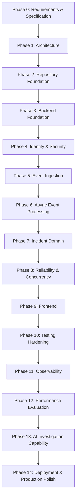

# ForgeOps — Delivery Phases & Milestones

Status: Foundation complete; implementation not started
Related: [PRD.md](./PRD.md) · [ARCHITECTURE.md](./ARCHITECTURE.md) · [DECISIONS.md](./DECISIONS.md) · [ENGINEERING_CONSTITUTION.md](./ENGINEERING_CONSTITUTION.md)

> This is a **high-level roadmap of phases and milestones only** — not a detailed task
> backlog. Detailed implementation tasks are defined at the start of each phase, against
> the requirements in [PRD.md](./PRD.md) and the rules in the
> [Engineering Constitution](./ENGINEERING_CONSTITUTION.md).
>
> The phase order is the preferred sequence. It changes only with a documented reason
> (and, where architecturally significant, an ADR in [DECISIONS.md](./DECISIONS.md)).

---

## Phase status legend

`Done` · `In progress` · `Not started`

---

## Roadmap overview

---

## Phases and milestones

### Phase 0 — Requirements & Specification — `Done`
Establish the documentation foundation.
- **Milestone:** The core foundation documents (constitution, PRD, architecture,
  decisions, tasks, README) exist, are internally consistent, and contain no application
  code. *(This phase.)*

### Phase 1 — Architecture — `Done`
Define the intended high-level architecture, the conceptual domain model, the system
invariants, and the initial decisions — so that persistence schemas, API contracts, and
application code can be built later without conceptual redesign.
- **Milestone:** [ARCHITECTURE.md](./ARCHITECTURE.md) (hardened architecture + conceptual
  domain model, incident state machine, transaction boundaries, idempotency model, outbox
  lifecycle, concurrency and failure semantics), [DOMAIN_MODEL.md](./DOMAIN_MODEL.md)
  (authoritative conceptual domain model: entities, aggregates, ownership, event↔incident
  relationship, correlation, assignment, audit and notification models),
  [ENGINEERING_INVARIANTS.md](./ENGINEERING_INVARIANTS.md) (stable invariants), and the
  ADRs in [DECISIONS.md](./DECISIONS.md) are in place. Domain and invariant design is
  complete.

### Phase 1b — Persistence Design — `Done`
Translate the approved domain model into a durable relational design while preserving the
invariants (no schema/migrations yet).
- **Milestone:** [PERSISTENCE_MODEL.md](./PERSISTENCE_MODEL.md) is in place (persistence
  structures, identifier and idempotency strategy, event→incident 0..1 representation,
  incident/state/assignment/comment/audit models, outbox model with concurrency and
  retention, index and constraint design, transaction boundaries, mutability policy, and
  the invariant-enforcement matrix), with persistence ADRs recorded in
  [DECISIONS.md](./DECISIONS.md).

### Phase 1c — API Contract Design — `Done`
Derive the external API interaction contract from the domain and persistence models (no
endpoints/DTOs/OpenAPI YAML yet).
- **Milestone:** [API_CONTRACTS.md](./API_CONTRACTS.md) is in place (resource inventory,
  URL versioning, authentication and authorization matrix, event ingestion with idempotency
  HTTP semantics, incident command endpoints and state-transition contract, ETag/If-Match
  concurrency, assignment/comments/audit/analytics APIs, non-authoritative SSE, advisory AI,
  RFC 9457 error model, validation, pagination, correlation ID, rate limiting, and
  API→domain→invariant traceability), with API ADRs recorded in
  [DECISIONS.md](./DECISIONS.md). **Repository/backend foundation (Phase 2) is the next
  gate** before any application code.

### Phase 2 — Repository Foundation — `In progress`
Establish project structure and tooling scaffolding (still no application logic).
- **Milestone:** Build tooling and repository conventions are ready for backend code.
- **Done so far:** `backend/` Spring Boot (Java 21) modular monolith via the Maven
  Wrapper; module packages (identity, events, incidents, audit, notifications, analytics,
  ai) with a minimal `common`; Actuator health endpoint; configuration foundation with no
  secrets; ArchUnit module-boundary tests plus context/health tests. `./mvnw clean verify`
  succeeds; `GET /actuator/health` returns `UP`.
- **Not done (deferred by scope):** no business logic, no database schema/migrations, no
  RabbitMQ/Redis, no frontend, no Docker/CI. This phase is not marked `Done` until the
  milestone is formally reviewed.

### Phase 3 — Backend Foundation — `In progress`
Establish the internal backend engineering architecture required before Identity, Events,
or Incident behavior.
- **Milestone:** Explicit, enforced internal architecture and cross-cutting foundations in
  place; build/tests/health still green.
- **Done so far:** module-internal layered architecture (api/application/domain/
  infrastructure) recorded in [ADR-0030](./DECISIONS.md#adr-0030--module-internal-layered-architecture-apiapplicationdomaininfrastructure)
  and documented in [backend/BACKEND_ARCHITECTURE.md](./backend/BACKEND_ARCHITECTURE.md);
  ArchUnit layer/boundary rules; `common` foundations only — correlation/request id,
  RFC 9457 Problem Details error handling, injectable `Clock`, and a UUID v7 `IdGenerator`
  (ADR-0023); logging, validation, transaction-boundary, and testing conventions
  documented. `./mvnw clean verify` passes 12/12; `/actuator/health` returns `UP` and
  echoes `X-Request-Id`.
- **Not done (deferred by scope):** no business logic, database, messaging, Redis,
  frontend, or AI. Not marked `Done` until the milestone is formally reviewed.

### Phase 4 — Identity & Security — `In progress` (design gate complete; implementation not started)
Implement admin-gated user provisioning, login, secure password storage, JWT auth, and
role-based access.
- **Design gate (Done):** [SECURITY_DESIGN.md](./SECURITY_DESIGN.md) defines the
  implementation-ready security architecture — Argon2id password hashing
  ([ADR-0031](./DECISIONS.md#adr-0031--argon2id-for-password-hashing)), RS256 short-lived
  access-only JWTs ([ADR-0032](./DECISIONS.md#adr-0032--rs256-short-lived-access-only-jwts-no-refresh-tokens-in-v1)),
  administrator-created accounts ([ADR-0033](./DECISIONS.md#adr-0033--administrator-created-accounts-no-open-self-registration)),
  authorization matrix, filter-chain order, 401/403 semantics, threat model, and test
  strategy. API_CONTRACTS.md reconciled (registration admin-gated; access-only tokens).
- **Phase 4.1 — Identity Persistence (In progress):** framework-free identity domain
  (User, Role, AccountStatus, PasswordHash port), JPA adapter, and Flyway migration for
  `users` + `user_roles` on PostgreSQL. Login identifier is a single unique `username`.
  ADRs [0034](./DECISIONS.md#adr-0034--flyway-for-database-migrations) (Flyway) and
  [0035](./DECISIONS.md#adr-0035--separate-jpa-entities-from-the-domain-model) (separate
  JPA entities) recorded. Bootstrap-admin credential creation **deferred to Phase 4.2**
  (needs hashing). Domain unit + architecture tests pass (15/15).
  **Verification status: GREEN — complete.** Authoritative GitHub Actions CI (Linux
  runner) executed the full Maven lifecycle including the PostgreSQL/Testcontainers
  integration tests, which passed. (The local Docker Desktop Engine 29 limitation below is
  retained as an environment note; it does not affect CI.)
- **Phase 4.2 — Slice 1: Argon2id password hashing (Done):** framework-free
  `PasswordHasher` domain port + `Argon2PasswordHasher` infrastructure adapter (Spring
  Security Crypto `Argon2PasswordEncoder` + Bouncy Castle) behind the existing
  `PasswordHash` boundary, with the SECURITY_DESIGN §5 baseline parameters (ADR-0031).
  6 focused unit tests; verified locally.
- **Phase 4.2 — Slice 3: login + RS256 JWT access-token issuance (In progress):**
  application `LoginService` (loads user, rejects unknown/disabled/wrong-password
  identically via `PasswordHasher.verify` with dummy-hash timing parity, no enumeration)
  + `AccessTokenIssuer` port; infrastructure `NimbusRs256AccessTokenIssuer` (RS256, claims
  `sub`/`roles`/`iss`/`aud`/`iat`/`exp`/`jti` derived server-side via `Clock` +
  `IdGenerator`); `JwtProperties`/`JwtKeyConfiguration` (RSA keys from env, never
  committed); public `POST /api/v1/auth/login` (`200 {access_token,token_type,expires_in}`
  / generic `401` RFC 9457) per API_CONTRACTS §4 and ADR-0032. Added `nimbus-jose-jwt`
  (pinned). Test-only RSA keys in `src/test/resources`. Non-container suite passes 37/37
  locally (9 new unit tests: login + JWT issuer). Login Testcontainers integration tests
  written; blocked locally by Docker Engine 29; **authoritative verification pending CI.**
  No JWT validation filter, principal extraction, authorization, 401/403 chain, or refresh
  tokens.
  **CI fix (test isolation):** the first CI run failed with
  `UserProvisioningIntegrationTests.provisionsAndRetrievesUser » UsernameAlreadyExists
  'alice'` — a shared-database isolation defect, not a production bug. The `@SpringBootTest`
  integration classes share one PostgreSQL container and do not roll back, so `alice`
  created by `LoginIntegrationTests` leaked into `UserProvisioningIntegrationTests` under a
  different CI execution order. Fixed by truncating the identity tables before each test in
  the three `@SpringBootTest` integration classes (test-only; production uniqueness /
  constraint / provisioning semantics unchanged). Re-verification **pending CI**.
- **Phase 4.2 — Slice 2: admin provisioning + bootstrap admin (In progress):**
  application-layer `UserProvisioningService` (server-generated UUID v7 id, Argon2id hash,
  role assignment, ACTIVE status, `@Transactional`, DB-authoritative username uniqueness)
  and an idempotent env-configured bootstrap admin (`BootstrapAdminProperties` +
  `BootstrapAdminInitializer` under `forgeops.security.bootstrap-admin.*`; creates the
  admin only when absent, never overwrites, never logs the secret). No self-registration
  endpoint, no JWT/auth/authorization. Non-container suite passes 28/28 locally (7 new
  provisioning unit tests). Provisioning + bootstrap Testcontainers integration tests are
  written but blocked locally by the Docker Engine 29 limitation; **authoritative
  verification pending CI.**
  **Historical note (4.1 root cause, retained):
  Root cause (investigated,
  evidence-backed):** Docker Engine 29 raised its minimum Docker API version; the
  docker-java client bundled with Testcontainers defaults to an older API version below
  that minimum, so the daemon rejects the `/info` call with HTTP 400 (empty body). The
  Docker CLI works because its Go client negotiates differently. Confirmed with
  Testcontainers 1.19.8 and 1.20.4 (docker-java 3.3.6/3.4.0), and a client-side
  `DOCKER_API_VERSION=1.44` pin (via shell and via surefire) did not resolve it. Public
  reports show even newer Testcontainers (1.20.6 / 1.21.3 / 2.0.x) do not fix this
  out-of-the-box, so a version bump is not a proven fix (no override is kept).
  **Unblock:** correct the environment — lower the Docker Desktop engine
  `min-api-version` (e.g. to `1.24`) for local runs, and/or verify on a Linux/CI Docker
  environment. DB-behavior verification (migration apply, constraints) remains **unproven**
  until the tests run on a compatible Docker engine.
- **Integration-test environment (implementation note):** local development on Docker
  Desktop with Docker Engine 29.x cannot run the Testcontainers integration tests
  (docker-java `/info` 400). The **authoritative integration verification runs in CI on a
  Linux Docker runner**, where Testcontainers works natively with no Docker workarounds. A
  minimal workflow exists at `.github/workflows/backend-ci.yml` (Ubuntu, JDK 21, Maven
  wrapper, `./mvnw -B clean verify`, no exclusions). **Pending execution:** this workspace
  is not yet a git repository with a remote, so CI has not run; Phase 4.1 stays **YELLOW**
  until the workflow executes and all tests (Testcontainers + context + health +
  architecture + unit) pass on CI.
- **Milestone (implementation):** Authenticated, authorized access works end to end
  (FR-ID-*). Authentication, JWT, authorization, and HTTP endpoints remain **not started**.

### Phase 5 — Event Ingestion — `Not started`
Implement the event ingestion API with validation, persistence, and idempotency.
- **Milestone:** Authenticated clients can submit and durably persist validated,
  de-duplicated events (FR-EV-1..4).

### Phase 6 — Async Event Processing — `Not started`
Implement the **transactional outbox** (event + outbox record committed in one
transaction), the outbox publisher that hands off to RabbitMQ, and idempotent consumers
that process under at-least-once delivery with explicit acknowledgement.
- **Milestone:** Accepted events reach asynchronous processing via the outbox and are
  processed idempotently by a worker (FR-EV-5, FR-RL-7..11; see
  [ADR-0013](./DECISIONS.md#adr-0013--transactional-outbox-for-reliable-event-publishing)
  and [ADR-0014](./DECISIONS.md#adr-0014--at-least-once-delivery-with-idempotent-consumers)).

### Phase 7 — Incident Domain — `Not started`
Implement incident lifecycle state machine, severity, assignment, notes, resolution,
audit, and event-driven detection/correlation.
- **Milestone:** Incidents are created (including via detection), managed, and audited
  (FR-IN-*).

### Phase 8 — Reliability & Concurrency — `Not started`
Harden transactions, concurrency protection, idempotent processing, retry policy,
dead-letter handling, and rate limiting; verify the outbox and consumers against the
reliability scenarios.
- **Milestone:** Reliability behaviors (FR-RL-*) are implemented and verified against the
  failure scenarios in
  [ARCHITECTURE.md §5.1](./ARCHITECTURE.md#51-reliability-scenarios-architectural-requirements).

### Phase 9 — Frontend — `Not started`
Build the React/TypeScript dashboard consuming REST + SSE, including live updates.
- **Milestone:** Engineers can view and investigate incidents with real-time updates
  (FR-RT-1).

### Phase 10 — Testing Hardening — `Not started`
Strengthen unit, integration, concurrency, and end-to-end tests.
- **Milestone:** The first full vertical slice (see [PRD §9](./PRD.md#9-first-end-to-end-vertical-slice-future-milestone))
  is proven by automated tests.

### Phase 11 — Observability — `Not started`
Wire Actuator/Micrometer metrics, Prometheus scraping, and Grafana dashboards.
- **Milestone:** Health and meaningful operational metrics are exposed (FR-OB-*).

### Phase 12 — Performance Evaluation — `Not started`
Establish reproducible performance/load tests and record measured results.
- **Milestone:** Performance is characterized by measurement, not assertion (NFR-8).

### Phase 13 — AI Investigation Capability — `Not started`
Add the optional, evidence-grounded AI investigation layer, isolated from the core.
- **Milestone:** AI assistance works when available and is fully optional (FR-AI-*,
  [Constitution §8](./ENGINEERING_CONSTITUTION.md#8-ai-development-rules)).

### Phase 14 — Deployment & Production Polish — `Not started`
Finalize local Docker Compose orchestration, CI, and production-readiness polish.
- **Milestone:** The platform is reproducibly runnable locally and validated in CI.

---

## Notes

- Each phase must satisfy the [Definition of Done](./ENGINEERING_CONSTITUTION.md#5-definition-of-done)
  before the next begins.
- No phase beyond Phase 1 is started until explicitly instructed.
